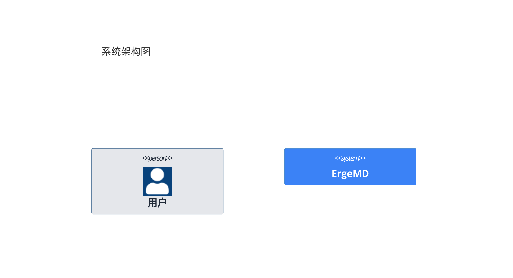

# ErgeMD 开发错误记录（血泪教训）

&gt; **最后编辑：2026-06-14**
&gt;
&gt; 此文件记录开发过程中犯过的所有错误和 bug 修复记录。
&gt; 切换窗口时请传递此文件，避免重复犯错。

---

## 一、Tauri 无边框窗口拖拽相关

### 规则（最高优先级）
**在 Tauri `decorations: false` 的窗口中，以下 CSS 属性会创建新的 stacking context，导致 `position: fixed` 元素的鼠标事件被裁剪/拦截，使 `startDragging()` 失效：**
- `overflow: hidden` / `overflow: auto` / `overflow: scroll`
- `position: relative` / `position: absolute`
- `transform`（任何值，包括 `translateX(0)`）
- `will-change`（任何值）
- `filter`、`backdrop-filter`
- `contain`、`isolation`

### 犯错记录

| #   | 错误                  | 文件             | 根因                                                     | 修复                             |
| --- | --------------------- | ---------------- | -------------------------------------------------------- | -------------------------------- |
| 1   | 窗口不能拖动          | AppLayout.tsx    | `overflow: "hidden"` 创建 stacking context               | 移除 `overflow: hidden`          |
| 2   | 窗口不能拖动          | useTitleBar.tsx  | `e.preventDefault()` 阻止 Tauri 接管拖拽                 | 移除 `e.preventDefault()`        |
| 3   | 窗口只有小区域可拖动  | TitleBar.tsx     | `data-no-drag` 放在外层容器，覆盖整个中间区域            | `data-no-drag` 放在每个 tab 项上 |
| 4   | 窗口不能拖动          | FileDropZone.tsx | 外层 div `position: "relative"` 创建 stacking context    | 移除 `position: relative`        |
| 5   | 右侧按钮高度只有 16px | TitleBar.tsx     | 容器 div 缺少 `height: "100%"`，子元素百分比高度无法解析 | 添加 `height: "100%"`            |

---

## 二、scrollIntoView 禁用

### 规则
**在包含 `position: fixed` 元素的布局中，禁止使用 `element.scrollIntoView()`。它会滚动所有可滚动祖先，可能意外影响其他 fixed 元素的位置。**

### 替代方案
```typescript
// ❌ 禁止
targetEl.scrollIntoView({ behavior: "smooth", block: "start" });

// ✅ 使用 container.scrollTo()
const containerRect = container.getBoundingClientRect();
const targetRect = targetEl.getBoundingClientRect();
const offset = targetRect.top - containerRect.top + container.scrollTop;
container.scrollTo({ top: offset - 48, behavior: "smooth" });
```

### 犯错记录

| #   | 错误                  | 文件            | 根因                              | 修复                        |
| --- | --------------------- | --------------- | --------------------------------- | --------------------------- |
| 1   | 点 TOC 文件树滑出屏幕 | FloatingTOC.tsx | `scrollIntoView()` 滚动了所有祖先 | 改用 `container.scrollTo()` |

---

## 三、CSS 选择器安全

### 规则
**所有动态生成的 CSS 选择器必须做空值保护。空字符串传入 `querySelector` 会导致 `SyntaxError` 崩溃。**

### 犯错记录

| #   | 错误                 | 文件              | 根因                                                                 | 修复                  |
| --- | -------------------- | ----------------- | -------------------------------------------------------------------- | --------------------- |
| 1   | 点击文件卡死（白屏） | useTOCObserver.ts | 标题 id 为空 → `CSS.escape("")` → `querySelector("#")` → SyntaxError | 跳过空 ID + try/catch |

---

## 四、导出/导入一致性

### 规则
**修改任何文件的 export 方式前，必须先确认所有引用方的 import 方式。改了 export 必须同步改所有 import。**

### 犯错记录

| #   | 错误                           | 文件          | 根因                                                                         | 修复                           |
| --- | ------------------------------ | ------------- | ---------------------------------------------------------------------------- | ------------------------------ |
| 1   | 白屏崩溃                       | AppLayout.tsx | 把 `export default` 改成 `export { AppLayout }`，与 App.tsx 的默认导入不匹配 | 改回 `export default`          |
| 2   | SearchReplace 导致导入方式错乱 | App.tsx       | SearchReplace 匹配到旧 import 块，替换后默认导入变成命名导入                 | 手动修正所有 import 为默认导入 |

---

## 五、Tailwind 迁移

### 规则
**项目使用 Tailwind v4（通过 `@tailwindcss/vite` 插件 + `@import "tailwindcss"`）。迁移 inline styles 到 className 时必须遵守以下规则：**

1. **只迁移纯布局类**：`display`、`position`、`overflow`、`z-index`、`cursor`、`userSelect`、`whiteSpace`、`flexShrink`、`flex`
2. **保留 inline**：所有间距（margin/padding）、尺寸（width/height）、颜色（含 CSS 变量）、字体大小/粗细、border、borderRadius、background、transition、transform、opacity、willChange、动态值
3. **保留 inline**：`onMouseEnter`/`onMouseLeave` 中直接修改的 style
4. **`@import "tailwindcss"` 必须在 globals.css 最顶部**（注释也要放在后面）
5. **Tauri 无边框窗口中，避免在 TitleBar 或可能影响拖拽的元素上使用 Tailwind 设置 `overflow`、`transform`、`will-change`**

### 犯错记录

| #   | 错误                           | 文件            | 根因                                                                                                                        | 修复                                             |
| --- | ------------------------------ | --------------- | --------------------------------------------------------------------------------------------------------------------------- | ------------------------------------------------ |
| 1   | 文件树不能滚动                 | FileList.tsx    | Tailwind v3 配置不完整，className 未编译                                                                                    | LeftPanel 包裹层用 inline styles（当时临时方案） |
| 2   | 左侧面板从顶部移开             | LeftPanel.tsx   | Tailwind v3 配置问题                                                                                                        | 全部改为 inline styles（当时临时方案）           |
| 3   | WelcomePage 迁移后全部挤到一起 | WelcomePage.tsx | 间距类（mb-*、mt-*、gap-*、py-*）迁移到 Tailwind 后未生效，原因未完全确认（可能与 Tailwind v4 的 preflight 或类名扫描有关） | 恢复 inline styles，只保留最外层容器的布局类     |

### 备注
- 项目已升级到 Tailwind v4（`@tailwindcss/vite`），v3 的配置问题已不存在
- 保守策略：间距/尺寸/颜色优先保留 inline，只迁移纯布局类
- 19 个组件已完成迁移，MarkdownView.tsx 保留最多 inline styles（渲染器组件，风险高）

---

## 六、类型安全

### 规则
**TypeScript 中 `undefined` 和 `null` 不互通。`useState(undefined)` 推断为 `undefined` 类型，不能赋给 `string | null`。所有可能为 undefined 的值用 `?? ""` 或 `?? null` 显式转换。**

### 犯错记录

| #   | 错误                   | 文件             | 根因                                                  | 修复                                   |
| --- | ---------------------- | ---------------- | ----------------------------------------------------- | -------------------------------------- |
| 1   | TS2345 类型错误        | MarkdownView.tsx | `useState(src)` 中 src 为 `string \| undefined`       | 改为 `useState(src ?? "")`             |
| 2   | TS2345 类型错误（3处） | MarkdownView.tsx | `setResolvedSrc(src)` 中 src 为 `string \| undefined` | 所有处改为 `setResolvedSrc(src ?? "")` |

---

## 七、Rust 未使用 import

### 规则
**生成 Rust 代码时必须逐行检查每个 import 是否被使用。不能从文档模板复制后不清理。**

### 犯错记录

| #   | 错误                          | 文件       | 根因                                 | 修复       |
| --- | ----------------------------- | ---------- | ------------------------------------ | ---------- |
| 1   | unused import `RecursiveMode` | watcher.rs | 从文档模板复制未清理                 | 移除       |
| 2   | unused import `PathBuf`       | watcher.rs | 从文档模板复制未清理                 | 移除       |
| 3   | unused import `Manager`       | watcher.rs | 从文档模板复制未清理                 | 移除       |
| 4   | unused import `Watcher`       | watcher.rs | 修复 #1 时漏了                       | 移除       |
| 5   | unnecessary `mut`             | watcher.rs | `recommended_watcher` 返回不可变引用 | 移除 `mut` |

---

## 八、本地代码优先

### 规则
**文档中的代码不能直接用。生成代码前必须先读取本地文件确认接口、导入方式、参数名。每行代码必须基于真实需求，不靠猜测和经验。**

### 犯错记录

| #   | 错误                     | 文件            | 根因                                      | 修复                       |
| --- | ------------------------ | --------------- | ----------------------------------------- | -------------------------- |
| 1   | `hideDelay` 不存在       | App.tsx         | 未读取本地 useAutoHide.ts，凭文档猜测参数 | 读取本地文件确认接口后再写 |
| 2   | TitleBar 缺少 transition | App.tsx         | 未读取本地 TitleBar.tsx 的 props 定义     | 读取后添加                 |
| 3   | WelcomePage 直接生成     | WelcomePage.tsx | 未先读取本地文件比对差异                  | 应先读取再增量修改         |

---

## 九、React Hooks 规则

### 规则
**ReactMarkdown 的 `components` 中的渲染器函数不是 React 组件，不能直接使用 hooks（useState、useEffect 等）。需要提取为独立的 React 组件。**

### 犯错记录

| #   | 错误                    | 文件             | 根因                               | 修复                         |
| --- | ----------------------- | ---------------- | ---------------------------------- | ---------------------------- |
| 1   | img 渲染器中用 useState | MarkdownView.tsx | 文档示例在渲染器函数中直接用 hooks | 提取为 `ClickableImage` 组件 |

---

## 十、事件冒泡

### 规则
**`data-no-drag` 必须放在最小粒度的交互元素上，不能放在外层容器。外层容器会覆盖子元素之间的空白区域，导致拖拽区域缩小。**

### 犯错记录

| #   | 错误                   | 文件         | 根因                                | 修复                                         |
| --- | ---------------------- | ------------ | ----------------------------------- | -------------------------------------------- |
| 1   | 标签栏空白处不能拖拽   | TitleBar.tsx | `data-no-drag` 放在 TabBar 外层容器 | 移到每个 tab 项上                            |
| 2   | 右侧按钮间空白不能拖拽 | TitleBar.tsx | `data-no-drag` 放在右侧外层 div     | 移除（button 已被 `closest("button")` 排除） |

---

## 十一、布局遮挡

### 规则
**新增的 fixed/absolute 定位组件必须检查是否遮挡已有组件。特别是 zIndex 层级：TitleBar=60, Toast/SearchBar/提示条=55, ImagePreview/ToastContainer=50, LeftPanel=40, 遮罩=30。**

### 犯错记录

| #   | 错误                                   | 文件    | 根因                                                                          | 修复                                                 |
| --- | -------------------------------------- | ------- | ----------------------------------------------------------------------------- | ---------------------------------------------------- |
| 1   | 打开文件夹后看不到变化（停留在欢迎页） | App.tsx | TitleBar 只在 `hasOpenFile` 时渲染，打开文件夹只设 `hasWorkspace` 不触发      | TitleBar 应在 `hasWorkspace \|\| hasOpenFile` 时渲染 |
| 2   | TOC 完全不可见                         | App.tsx | `extractTOC` 被 import 但未调用，`tocItems` 始终为空，FloatingTOC return null | 在 content 变化时调用 extractTOC 填充 tocItems       |

---

## 十二、集成遗漏

### 规则
**集成新组件到 App.tsx 时，必须检查：1) 新组件是否遮挡已有组件 2) 已有功能是否被破坏 3) store 数据流是否完整（有没有只声明未使用的 state/hook）。**

### 犯错记录

| #   | 错误                          | 文件             | 根因                                                | 修复                               |
| --- | ----------------------------- | ---------------- | --------------------------------------------------- | ---------------------------------- |
| 1   | FileDropZone 导致窗口不能拖动 | FileDropZone.tsx | 外层 div `position: relative` 创建 stacking context | 移除 `position: relative`          |
| 2   | setTOCItems 声明但未使用      | App.tsx          | Task 10 集成时错误添加了 store 选择器               | 移除未使用的声明                   |
| 3   | TOC 不可见                    | App.tsx          | extractTOC 未被调用，tocItems 始终为空              | 在 content 变化时调用 extractTOC   |
| 4   | 打开文件夹后 TitleBar 不显示  | App.tsx          | TitleBar 渲染条件只有 hasOpenFile                   | 改为 hasOpenFile \|\| hasWorkspace |

---

## 十三、flex 布局滚动

### 规则
**flex 容器中子元素使用 `flex: 1` 填充剩余空间时，必须同时设置 `minHeight: 0`（或 `minWidth: 0`），否则子元素内容会撑开容器阻止滚动。**

### 犯错记录

| #   | 错误           | 文件          | 根因                                            | 修复                                      |
| --- | -------------- | ------------- | ----------------------------------------------- | ----------------------------------------- |
| 1   | 文件树不能滚动 | LeftPanel.tsx | flex 子元素默认 `minHeight: auto`，阻止内容溢出 | 添加 `minHeight: 0` + `overflowY: "auto"` |

---

## 十四、DOM drag 事件禁用

### 规则（最高优先级，与第一条并列）
**在 Tauri 无边框窗口中，禁止使用任何 DOM drag 事件（`onDragEnter`/`onDragOver`/`onDragLeave`/`onDrop`），包括 React DOM 事件和 window 级别事件。DOM drag 事件会干扰 Tauri 的 `startDragging()` 原生拖拽事件链，导致窗口无法移动。**

### 替代方案
```typescript
// ❌ 禁止：DOM drag 事件
&lt;div onDragOver={(e) =&gt; e.preventDefault()} onDrop={handleDrop}&gt;

// ❌ 禁止：window 级别 drag 事件
window.addEventListener("dragover", handler);

// ✅ 使用 Tauri 原生 onDragDropEvent
import { getCurrentWebview } from "@tauri-apps/api/webview";
getCurrentWebview().onDragDropEvent((event) =&gt; {
  const { type, paths } = event.payload;
  // type: "over" | "drop" | "leave" | "cancel"
  // paths: string[] (文件路径)
});
```

### 犯错记录

| #   | 错误                     | 文件             | 根因                                                               | 修复                                                           |
| --- | ------------------------ | ---------------- | ------------------------------------------------------------------ | -------------------------------------------------------------- |
| 1   | 窗口不能拖动             | FileDropZone.tsx | 外层 div 的 `onDragOver` 事件干扰 Tauri                            | 改用 Tauri 原生 onDragDropEvent                                |
| 2   | 窗口不能拖动             | ReadingArea.tsx  | `onDragOver={(e) =&gt; e.preventDefault()}` 干扰 Tauri             | 移除，改用 Tauri 原生 API                                      |
| 3   | 窗口不能拖动             | AppLayout.tsx    | `{...rest}` 透传 drag 事件到根 div                                 | 恢复原始接口，移除 drag 事件                                   |
| 4   | 窗口不能拖动             | FileDropZone.tsx | window 级别 `dragover` 的 `e.stopPropagation()` 干扰 Tauri         | 改用 Tauri 原生 API                                            |
| 5   | 窗口初始化时不能拖动     | WelcomePage.tsx  | `onDragOver`/`onDrop` DOM drag 事件干扰 Tauri startDragging()      | 移除 DOM drag 事件，依赖 App.tsx 的 Tauri 原生 onDragDropEvent |
| 6   | 窗口初始化时不能拖动     | TitleBar.tsx     | `willChange: "opacity"` 创建 stacking context，裁剪 fixed 元素事件 | 移除 willChange                                                |
| 7   | 欢迎页状态下窗口不能拖动 | App.tsx          | TitleBar 只在 `hasOpenFile hasWorkspace` 时渲染，欢迎页无拖拽区域  | 始终渲染 TitleBar（移除条件判断）                              |

---

## 十五、CSS 变量优先级

### 规则
**`:root` 与 `[data-theme]` 的 CSS 优先级相同（都是 0-1-0）。如果 `:root` 在 `@import` 之后声明，`:root` 会覆盖主题文件中的变量，导致主题切换无效。**

### 替代方案
```css
/* ❌ 错误：:root 会覆盖 @import 进来的 [data-theme] 变量 */
:root { --bg-page: #0A0A0F; }

/* ✅ 正确：仅在无 data-theme 时生效的兜底 */
html:not([data-theme]) { --bg-page: #0A0A0F; }
```

### 犯错记录

| #   | 错误                                          | 文件        | 根因                                                             | 修复                          |
| --- | --------------------------------------------- | ----------- | ---------------------------------------------------------------- | ----------------------------- |
| 1   | 主题切换无效（Ctrl+Shift+T 有日志但视觉不变） | globals.css | `:root` 在 `@import` 之后声明，覆盖了 `[data-theme]` 的 CSS 变量 | 改为 `html:not([data-theme])` |

---

## 十六、Mermaid 图表主题

### 规则
**Mermaid 默认使用 `htmlLabels: true`，通过 `&lt;foreignObject&gt;` 嵌入 HTML 渲染文字。在 Tauri / Electron / JCEF 等嵌入式 WebView 中，`&lt;foreignObject&gt;` 内的 HTML 渲染存在兼容性问题，导致文字不可见（图形正常）。**

### 替代方案
```javascript
// ❌ 错误：htmlLabels: true（默认值），在嵌入式 WebView 中文字不可见
mermaid.initialize({ flowchart: { htmlLabels: true } });

// ✅ 正确：htmlLabels: false，使用原生 SVG &lt;text&gt; 元素
mermaid.initialize({ flowchart: { htmlLabels: false } });
```

### 注意事项
- `htmlLabels: false` 不支持 HTML 标签（`&lt;br&gt;`、`&lt;b&gt;` 等），只支持纯文本
- `themeVariables` 不支持 CSS 变量（`var(--xxx)`），必须用实际颜色值
- CSS `!important` 无法覆盖 `&lt;foreignObject&gt;` 内的 HTML 元素样式

### 犯错记录

| #   | 错误                                               | 文件               | 根因                                                                                            | 修复                                                                         |
| --- | -------------------------------------------------- | ------------------ | ----------------------------------------------------------------------------------------------- | ---------------------------------------------------------------------------- |
| 1   | Mermaid 流程图只能看到图形看不到文字               | MermaidDiagram.tsx | `theme: "dark"` 写死，`themeVariables` 使用硬编码赛博朋克色值                                   | 引入 useTheme，根据主题动态选择 Mermaid 主题                                 |
| 2   | Mermaid 三种主题下文字都不可见                     | MermaidDiagram.tsx | `themeVariables` 使用 `var(--xxx)` CSS 变量，Mermaid 不解析                                     | themeVariables 改用实际颜色值                                                |
| 3   | Mermaid 文字仍然不可见（多次尝试失败）             | MermaidDiagram.tsx | `htmlLabels: true`（默认值）使用 `&lt;foreignObject&gt;` 渲染文字，Tauri WebView 不支持         | 设置 `htmlLabels: false`，改用原生 SVG `&lt;text&gt;`                        |
| 4   | SVG 内注入 `&lt;style&gt;` 导致图表变成黑色形状    | MermaidDiagram.tsx | SVG 命名空间内嵌 HTML `&lt;style&gt;` 破坏了 SVG 结构                                           | 移除注入，改用 DOM 后处理                                                    |
| 5   | `htmlLabels: false` 文字错位                       | MermaidDiagram.tsx | Mermaid 已知 bug（#1177），htmlLabels false 时文字不居中                                        | 回退到 htmlLabels true                                                       |
| 6   | Mermaid 文字不可见的真正根因                       | MermaidDiagram.tsx | Phase 3 添加的 SVG 预处理正则（移除 width/height）破坏了 `&lt;foreignObject&gt;` 内部 HTML 布局 | 恢复 Phase 2 最小化配置，不做 SVG 预处理和 DOM 后处理                        |
| 7   | Mermaid v11 中文文字截断（每个节点缺最后一个字符） | Mermaid v11        | Mermaid v11 的已知 bug（中文/CJK 字符宽度计算错误）                                             | 无法修复，等官方修复。降级 v10.6.1 会导致 esbuild 构建报错（模块结构不兼容） |

---

## 十七、Mermaid xychart 语法与版本

### 规则
**Mermaid 11.10.0+ 正式支持 `xychart`（不再是 beta），必须使用 `xychart` 而非 `xychart-beta`。标题/轴标签中使用中文可能导致词法分析错误，建议先用纯英文测试通过后再调整。**

### 犯错记录

| #   | 错误                                             | 文件          | 根因                                                                                            | 修复                                                              |
| --- | ------------------------------------------------ | ------------- | ----------------------------------------------------------------------------------------------- | ----------------------------------------------------------------- |
| 1   | xychart 渲染失败，报错 "Lexical error on line 3" | MD测试文档.md | 1) 使用 `xychart-beta`（v11.14.0 已移除） 2) 标题/轴标签包含中文/中文括号可能导致词法分析器错误 | 升级 Mermaid 到 11.14.0 + 使用 `xychart` + 先用官方纯英文示例测试 |
| 2   | Mermaid 版本升级                                 | package.json  | 旧版本 11.4.1 不支持 xychart                                                                    | 升级到 11.14.0，构建通过，xychartDiagram 模块已包含               |

### 参考
- Mermaid 官方文档：https://mermaid.js.org/syntax/xyChart
- 官方示例代码可直接复制使用，确保兼容性

---

## 十八、快捷键调试

### 规则
**快捷键不工作时，按以下顺序排查：1) 确认 handler 注册成功（console.log）2) 确认 store 更新成功 3) 确认副作用（useEffect）被触发 4) 确认没有其他代码覆盖结果。**

### 犯错记录

| #   | 错误                        | 文件 | 根因                                                       | 修复                             |
| --- | --------------------------- | ---- | ---------------------------------------------------------- | -------------------------------- |
| 1   | Ctrl+Shift+T 主题切换不生效 | —    | 本地 useTheme.ts 文件未正确部署，导致 App 组件 import 失败 | 确认所有新建文件已正确复制到本地 |

---

## 十九、Tauri invoke 参数命名

### 规则
**Tauri 2 的 `invoke()` 默认不做 camelCase → snake_case 转换。JS 传的参数名必须与 Rust 函数签名的参数名完全一致（包括大小写）。**

### 犯错记录

| #   | 错误                  | 文件    | 根因                                                               | 修复                                          |
| --- | --------------------- | ------- | ------------------------------------------------------------------ | --------------------------------------------- |
| 1   | 最近文件列表为空      | App.tsx | JS 传 `{ filePath, fileName }` 但 Rust 期望 `file_path, file_name` | 改为 snake_case                               |
| 2   | invoke 错误被静默吞掉 | App.tsx | `.catch(() =&gt; {})` 吞掉了所有错误                               | 改为 `.catch((err) =&gt; console.error(...))` |

---

## 二十、Zustand persist 反序列化安全

### 规则
**使用 `zustand/middleware` 的 `persist` 时，必须提供自定义 `merge` 函数。否则 localStorage 中存储的旧版数据结构（缺少新增字段）反序列化后，缺失字段为 `undefined` 而非使用默认值。**

### 正确做法
```typescript
persist(
  (set) =&gt; ({ ... }),
  {
    name: "store-key",
    partialize: (state) =&gt; ({ settings: state.settings }),
    merge: (persisted, current) =&gt; ({
      ...current,
      settings: {
        ...defaultSettings,        // 先铺默认值
        ...((persisted as any).settings || {}),  // 再覆盖已持久化的值
      },
    }),
  },
),
```

### 犯错记录

| #   | 错误                                     | 文件             | 根因                                                   | 修复                                                      |
| --- | ---------------------------------------- | ---------------- | ------------------------------------------------------ | --------------------------------------------------------- |
| 1   | settingsStore 新增字段升级后为 undefined | settingsStore.ts | persist 未配置 merge，旧版 localStorage 数据缺少新字段 | 添加自定义 merge 函数，与 defaultReadingSettings 深度合并 |

---

## 二十一、双数据源竞态

### 规则
**当同一个状态同时从 localStorage（同步）和 Tauri 后端数据库（异步）加载时，必须明确 source of truth。后端异步加载不应无条件覆盖 localStorage 中的数据，否则用户在当前会话中修改的设置会被旧数据覆盖。**

### 正确做法
```typescript
loadSettings: async () =&gt; {
  const stored = localStorage.getItem("store-key");
  if (!stored) {
    // 仅在 localStorage 无数据时从数据库加载
    set({ settings: await invoke("get_settings") });
  }
},
```

---

## 二十二、useCallback 依赖数组与声明顺序

### 规则
**当 `useCallback A` 依赖 `useCallback B` 时，B 必须在 A 之前声明。虽然 `useCallback` 的回调函数不会在声明时执行（闭包在调用时解析），但代码顺序影响可读性，且某些 lint 规则会报错。**

### 犯错记录

| #   | 错误                                                   | 文件          | 根因                                               | 修复                                                        |
| --- | ------------------------------------------------------ | ------------- | -------------------------------------------------- | ----------------------------------------------------------- |
| 1   | SearchBar 中 clearHighlights 在 performSearch 之后声明 | SearchBar.tsx | performSearch 依赖 clearHighlights，但声明顺序相反 | 将 clearHighlights 和 scrollToMatch 移到 performSearch 之前 |

---

## 二十三、React Hook 性能：避免高频 setState

### 规则
**在 `mousemove`、`scroll` 等高频事件处理器中，必须先比较当前状态值，仅在值变化时才调用 `setState`。否则每次事件（60+次/秒）都触发 React re-render，导致严重性能问题。**

### 正确做法
```typescript
// ❌ 错误：每次 mousemove 都 setState
const handleMouseMove = (e) =&gt; {
  setVisible(true);  // 即使已经 visible
};

// ✅ 正确：用 ref 追踪状态，仅变化时 setState
const stateRef = useRef({ visible: false });
const handleMouseMove = (e) =&gt; {
  if (!stateRef.current.visible) {
    stateRef.current.visible = true;
    setVisible(true);
  }
};
```

---

## 二十四、IntersectionObserver 不要与被观察数据耦合

### 规则
**当 IntersectionObserver 的回调会修改 effect 依赖数组中的数据时，会导致 Observer 被频繁销毁和重建。应将"观察结果"（如 isActive 标记）与"被观察数据"（如 tocItems 列表）分离存储。**

### 犯错记录

| #   | 错误                                       | 文件              | 根因                                                                    | 修复                                               |
| --- | ------------------------------------------ | ----------------- | ----------------------------------------------------------------------- | -------------------------------------------------- |
| 1   | useTOCObserver 每次标题激活都重建 Observer | useTOCObserver.ts | updateCurrentHeading 修改 tocItems（新数组），tocItems 在 effect 依赖中 | 将 isActive 状态分离到独立的 activeHeadingId state |

---

## 二十五、useCallback 依赖过多导致事件监听器频繁重建

### 规则
**当 `useCallback` 的依赖数组超过 5 个且包含频繁变化的 store 值时，应将变化值存入 `useRef`，在回调内通过 `.current` 读取。否则每次值变化都会导致回调重建，进而导致 `useEffect` 中的事件监听器被频繁注销/注册。**

### 正确做法
```typescript
// ❌ 错误：15 个依赖，频繁重建
const handleKeyDown = useCallback(async (e) =&gt; {
  if (useReaderStore.getState().isSearchOpen) { ... }
}, [closeTab, activeTabId, tabs, isSearchOpen, ...]); // 15 个依赖

// ✅ 正确：0 个依赖，通过 getState() 和 ref 读取最新值
const handleKeyDown = useCallback(async (e) =&gt; {
  const { isSearchOpen } = useReaderStore.getState();
  const { activeTabId, tabs } = useFileStore.getState();
  ...
}, []); // 稳定引用
```

---

## 二十六、package.json 依赖完整性

### 规则
**代码中 `import` 的所有包必须显式列在 `package.json` 的 `dependencies` 中。不能依赖传递依赖（尤其是 pnpm 严格模式下会直接报错）。**

### 犯错记录

| #   | 错误                               | 文件         | 根因                                                 | 修复                             |
| --- | ---------------------------------- | ------------ | ---------------------------------------------------- | -------------------------------- |
| 1   | i18next / react-i18next 未列入依赖 | package.json | i18n/index.ts 导入了这两个包但 package.json 中未声明 | `pnpm add i18next react-i18next` |

---

## 二十七、useEffect 依赖数组导致无限循环（内存暴涨）

### 规则
**当 `useEffect` 内部通过 `setState` 修改了依赖数组中的变量时，会形成 `effect → setState → 依赖变化 → effect 重新执行` 的无限循环。每帧创建新的 RAF/setTimeout 链，内存暴涨直至卡死。**

### 正确做法
```typescript
// ❌ 错误：tocScrollOffset 在依赖中，动画内 setTocScrollOffset 触发 effect 重执行
useEffect(() =&gt; {
  const step = () =&gt; {
    setTocScrollOffset((prev) =&gt; {
      // ...
      requestAnimationFrame(step); // 新的 RAF
      return next;
    });
  };
  requestAnimationFrame(step);
}, [isHovering, autoTranslateY, tocScrollOffset]); // ← tocScrollOffset 导致无限循环

// ✅ 正确：用 useRef 读取最新值，不放入依赖数组
const tocScrollOffsetRef = useRef(tocScrollOffset);
tocScrollOffsetRef.current = tocScrollOffset;

useEffect(() =&gt; {
  const step = () =&gt; {
    const current = tocScrollOffsetRef.current; // 通过 ref 读取
    setTocScrollOffset(next);
    requestAnimationFrame(step);
  };
  requestAnimationFrame(step);
}, [isHovering, autoTranslateY]); // ← 不包含 tocScrollOffset
```

### 犯错记录

| #   | 错误             | 文件            | 根因                                                                                | 修复                                   |
| --- | ---------------- | --------------- | ----------------------------------------------------------------------------------- | -------------------------------------- |
| 1   | 软件内存占满卡死 | FloatingTOC.tsx | snapBack useEffect 依赖 `tocScrollOffset`，动画内 `setTocScrollOffset` 触发无限循环 | 用 `useRef` 读取最新值，从依赖数组移除 |

---

## 二十八、React 合成事件 vs 原生事件的 stopPropagation

### 规则
**React 的 `onWheel` 是合成事件，`e.stopPropagation()` 只阻止 React 合成事件冒泡，不阻止原生 DOM 事件传播。如果组件是 `position: fixed` 且不在滚动容器的 DOM 树内，浏览器的默认滚轮行为仍会传递到下方的滚动容器。**

### 替代方案
```typescript
// ❌ 错误：React onWheel + stopPropagation 无法阻止原生事件传播
&lt;div onWheel={(e) =&gt; { e.stopPropagation(); /* 正文仍然会滚动 */ }}&gt;

// ✅ 正确：原生 addEventListener + stopImmediatePropagation + preventDefault
useEffect(() =&gt; {
  const el = ref.current;
  const onWheel = (e: WheelEvent) =&gt; {
    e.stopImmediatePropagation();
    e.preventDefault();
    // 现在正文完全不会滚动
  };
  el.addEventListener("wheel", onWheel, { passive: false });
  return () =&gt; el.removeEventListener("wheel", onWheel);
}, []);
```

### 犯错记录

| #   | 错误                         | 文件            | 根因                                                                   | 修复                                                                                                          |
| --- | ---------------------------- | --------------- | ---------------------------------------------------------------------- | ------------------------------------------------------------------------------------------------------------- |
| 1   | hover TOC 时正文仍然跟随滚动 | FloatingTOC.tsx | React `onWheel` + `stopPropagation` 无法阻止原生事件传播到下方滚动容器 | 改用原生 `addEventListener("wheel", ..., { passive: false })` + `stopImmediatePropagation` + `preventDefault` |

---

## 二十九、虚拟列表 visibleRange[0] 不等于当前阅读位置

### 规则
**`@tanstack/react-virtual` 的 `virtualizer.getVirtualItems()[0].index` 返回的是视口**顶部第一个可见 block**，而非用户当前正在阅读的 block。当用户滚动到某个标题时，视口顶部可能还露出上一个章节的尾部内容（空白行、段落等），导致 TOC 高亮匹配到上一个章节。**

### 正确做法
```typescript
// ❌ 错误：取视口顶部 block，可能匹配到上一个章节
onActiveBlockChange?.(visibleRange[0].index);

// ✅ 正确：取视口中部的 block，更接近用户实际阅读位置
const midIndex = visibleRange[Math.floor(visibleRange.length / 2)]?.index;
onActiveBlockChange?.(midIndex ?? visibleRange[0].index);
```

### 犯错记录

| #   | 错误                                 | 文件                    | 根因                                                                                  | 修复                                                                  |
| --- | ------------------------------------ | ----------------------- | ------------------------------------------------------------------------------------- | --------------------------------------------------------------------- |
| 1   | 点击 TOC 跳转后高亮往上飘一个章节    | VirtualMarkdownView.tsx | `visibleRange[0].index` 取视口顶部 block，padding/margin 导致上一个章节尾部仍在视口内 | 点击时通过 `onActiveTocChange` 立即设置高亮，500ms 内忽略 scroll 回调 |
| 2   | 非 hover 滚动时 TOC 高亮偏移一个章节 | VirtualMarkdownView.tsx | 同上，视口顶部 block 不代表当前阅读位置                                               | 改用 `visibleRange` 中部 block 索引                                   |

---

## 三十、Tab 切换后状态未立即同步

### 规则
**切换 Tab 时，如果新 Tab 的状态（如 TOC 高亮位置）依赖 scroll 位置，必须立即根据当前 scroll 位置计算状态，不能简单重置为 0 然后等待 scroll 事件。因为切换 Tab 本身不会触发 scroll 事件，状态会一直停在初始值。**

### 正确做法
```typescript
// ❌ 错误：简单重置为 0，等待 scroll 事件更新
useEffect(() =&gt; {
  if (isActive) setActiveBlockIndex(0);
}, [isActive]);

// ✅ 正确：立即根据 scroll 位置计算
useEffect(() =&gt; {
  if (!isActive) return;
  const el = scrollContainerRef.current;
  if (!el) { setActiveBlockIndex(0); return; }
  // 大文档：通过 DOM data-index 获取
  const firstVisible = el.querySelector("[data-index]");
  setActiveBlockIndex(parseInt(firstVisible?.getAttribute("data-index") || "0", 10));
  // 小文档：通过 scroll 百分比映射
  // ...
}, [isActive, useVirtual, content]);
```

### 犯错记录

| #   | 错误                                       | 文件            | 根因                                                | 修复                                                          |
| --- | ------------------------------------------ | --------------- | --------------------------------------------------- | ------------------------------------------------------------- |
| 1   | 切换 Tab 后 TOC 高亮停在顶部，需滚动才更新 | ReadingArea.tsx | `setActiveBlockIndex(0)` 只重置，不读取 scroll 位置 | 立即通过 DOM data-index 或 scroll 百分比计算 activeBlockIndex |
| 2   | 打开文件后 TOC 几秒后才跟随                | ReadingArea.tsx | 同上，初始加载时 scroll 事件未触发                  | 同上                                                          |

---

## 三十一、isTableLine 过于宽泛导致 block 膨胀

### 规则
**Markdown 分块解析器中，表格行检测不能仅凭"包含 `|` 字符"就判定为表格。普通文本中的管道符（如 `a | b`、`shell: cmd1 | cmd2`）会被误判，导致段落被错误合并为表格块，增加不必要的 ReactMarkdown 实例化开销。**

### 正确做法
```typescript
// ❌ 错误：任何含 | 的行都算表格
function isTableLine(line: string): boolean {
  return /^\|/.test(line.trim()) || /\|/.test(line.trim());
}

// ✅ 正确：要求以 | 开头/结尾，或至少 2 个 | 且排除行内代码
function isTableLine(line: string): boolean {
  const trimmed = line.trim();
  if (/^\|/.test(trimmed) || /\|$/.test(trimmed)) return true;
  const pipeCount = (trimmed.match(/\|/g) || []).length;
  if (pipeCount &gt;= 2) {
    const stripped = trimmed.replace(/`[^`]*`/g, "");
    if ((stripped.match(/\|/g) || []).length &gt;= 2) return true;
  }
  return false;
}
```

### 犯错记录

| #   | 错误                         | 文件              | 根因                                                     | 修复                                              |
| --- | ---------------------------- | ----------------- | -------------------------------------------------------- | ------------------------------------------------- |
| 1   | 长文档加载慢，block 数量过多 | markdownBlocks.ts | `isTableLine` 匹配任何含 `\|` 的行，普通段落被吞入表格块 | 收紧判断条件 + 新增 `isTableSeparator` 分隔行检测 |

---

## 三十二、Markdown 表格对齐不生效

### 规则
**Markdown 表格对齐由 remark-gfm 处理，会在 `th`/`td` 上设置 `align` 属性。自定义 ReactMarkdown 组件时，需要正确读取并应用这个属性，同时注意不要硬编码 `textAlign` 覆盖它。还要确保两个渲染器（`MarkdownView.tsx` 小文件和 `MarkdownBlockView.tsx` 大文件）都修复。**

### 正确做法
```typescript
// 在自定义 th 和 td 组件里
th(props: React.HTMLAttributes&lt;HTMLTableCellElement&gt;) {
  const { children, style, ...rest } = props;
  const anyProps = props as any;
  const align = anyProps.align || anyProps.node?.properties?.align;
  const incomingStyle = style as React.CSSProperties | undefined;

  return (
    &lt;th
      {...anyProps} // 保留原始属性，包括 align
      style={{
        // 先设置默认样式
        padding: "0.6em 1em",
        fontWeight: 600,
        color: "var(--text-heading)",
        // 再展开用户传入的样式
        ...incomingStyle,
        // 最后应用对齐
        textAlign: incomingStyle?.textAlign || align,
      }}
    &gt;
      {children}
    &lt;/th&gt;
  );
}
```

---

## 三十三、Mermaid ThemeVariables 配置经验总结

### 33.1 核心知识点

#### 33.1.1 themeVariables 生效条件
- **必须使用 `base` 主题**：Mermaid 官方文档明确说明，只有 `base` 主题支持自定义 `themeVariables`
- 错误示例：
  ```javascript
  const mermaidTheme = colors.isLight ? "default" : "dark"; // ❌ 不支持 themeVariables
  ```
- 正确示例：
  ```javascript
  const mermaidTheme = "base"; // ✅ 支持 themeVariables 自定义
  ```

#### 33.1.2 darkMode 参数的重要性
- Mermaid 的 `base` 主题默认是暗色风格
- **亮色主题必须设置 `darkMode: false`**，否则颜色计算会错误
- 配置示例：
  ```javascript
  if (colors.isLight &amp;&amp; isMindmap) {
    const vars = themeVariables as any;
    vars.darkMode = false; // ✅ 关键设置
    // ... 其他配置
  }
  ```

#### 33.1.3 思维导图专用变量
Mermaid 提供了思维导图专用的 themeVariables：
- `mindmapLevel1BgColor` / `mindmapLevel1TextColor` - 一级节点
- `mindmapLevel2BgColor` / `mindmapLevel2TextColor` - 二级节点
- `mindmapLevel3BgColor` / `mindmapLevel3TextColor` - 三级节点
- `cScale0` ~ `cScale5` - 分支颜色配置
- `cScaleInv0` ~ `cScaleInv5` - 反向分支颜色

---

### 33.2 常见问题与解决方案

#### 33.2.1 问题：亮色主题配置不生效
**现象**：设置了亮色主题的 `themeVariables`，但思维导图仍然显示暗色配色

**根因**：未设置 `darkMode: false`，Mermaid 使用默认的暗色颜色计算逻辑

**解决方案**：在亮色主题配置中添加：
```javascript
vars.darkMode = false;
```

#### 33.2.2 问题：主题切换后颜色异常
**现象**：切换主题后，思维导图显示错误的颜色（如图2、图3显示灰色或黑色）

**根因**：缓存机制导致旧主题的渲染结果被复用，且 Mermaid 全局配置被污染

**解决方案**：
1. 监听主题变化事件
2. 清除所有缓存
3. 重置渲染状态
```javascript
useEffect(() =&gt; {
  mermaidCache.clear();
  setSvgHtml("");
  setIsVisible(false);
  // 重新触发渲染
}, [resolvedTheme]);
```

#### 33.2.3 问题：文字颜色看不清
**现象**：暗色主题中文本颜色过暗，亮色主题中文本颜色过亮

**根因**：文本颜色与背景色对比度不足

**解决方案**：
- 暗色主题：所有节点文本使用 `#FFFFFF`（白色）
- 亮色主题：所有节点文本使用 `#FFFFFF`（白色），配合深色背景节点

#### 33.2.4 问题：TypeScript 类型错误
**现象**：`Property 'cScale0' does not exist on type`

**根因**：Mermaid 的 themeVariables 类型定义不包含自定义颜色变量

**解决方案**：使用类型断言
```javascript
const vars = themeVariables as any;
vars["cScale0"] = "#6C5CE7";
```

---

### 33.3 推荐配置模式

#### 33.3.1 暗色主题思维导图配置
```javascript
if (!colors.isLight &amp;&amp; isMindmap) {
  const vars = themeVariables as any;
  vars.primaryColor = "#6C5CE7";
  vars.primaryTextColor = "#FFFFFF";
  vars.mindmapLevel1BgColor = "#6C5CE7";
  vars.mindmapLevel1TextColor = "#FFFFFF";
  vars.mindmapLevel2BgColor = "#3B82F6";
  vars.mindmapLevel2TextColor = "#FFFFFF";
  vars.mindmapLevel3BgColor = "#818CF8";
  vars.mindmapLevel3TextColor = "#FFFFFF";
  vars["cScale0"] = "#6C5CE7";
  vars["cScale1"] = "#3B82F6";
  vars["cScale2"] = "#818CF8";
  vars["cScale3"] = "#F59E0B";
  vars["cScale4"] = "#10B981";
  vars["cScale5"] = "#EC4899";
}
```

#### 33.3.2 亮色主题思维导图配置
```javascript
if (colors.isLight &amp;&amp; isMindmap) {
  const vars = themeVariables as any;
  vars.darkMode = false; // ✅ 必须设置
  vars.primaryColor = "#2ECC71";
  vars.primaryTextColor = "#FFFFFF";
  vars.mindmapLevel1BgColor = "#2ECC71";
  vars.mindmapLevel1TextColor = "#FFFFFF";
  vars.mindmapLevel2BgColor = "#3B82F6";
  vars.mindmapLevel2TextColor = "#FFFFFF";
  vars.mindmapLevel3BgColor = "#8B5CF6";
  vars.mindmapLevel3TextColor = "#FFFFFF";
  vars["cScale0"] = "#2ECC71";
  vars["cScale1"] = "#3B82F6";
  vars["cScale2"] = "#8B5CF6";
  vars["cScale3"] = "#F59E0B";
  vars["cScale4"] = "#EF4444";
  vars["cScale5"] = "#10B981";
}
```

---

### 33.4 调试技巧

#### 33.4.1 添加调试日志
```javascript
console.log("[MermaidDiagram] chartType:", chartType);
console.log("[MermaidDiagram] isLight:", colors.isLight);
console.log("[MermaidDiagram] themeVariables:", themeVariables);
```

#### 33.4.2 缓存版本控制
通过版本号强制刷新缓存：
```javascript
const cacheKey = JSON.stringify({
  theme: resolvedTheme,
  chart,
  isLight: colors.isLight,
  _version: "v16", // 更新版本号强制刷新
});
```

#### 33.4.3 验证步骤
1. 确认 `isLight` 状态正确（`true` 表示亮色，`false/undefined` 表示暗色）
2. 确认 `mermaidTheme` 设置为 `"base"`
3. 确认亮色主题设置了 `darkMode: false`
4. 确认缓存已清除（更新版本号）

---

## 三十四、Emoji 别名与兼容性

### 规则

**`remark-emoji` 插件使用 `gemoji` 包进行别名映射，不是所有口语化别名都被支持。常用别名如 `:+1:`（👍）是支持的，但 `:thumbsup:` 可能不被识别。在示例文档中应使用标准别名以确保兼容性。**

---

## 三十五、CSS 变量定义位置导致主题切换失效

### 规则
**主题相关的 CSS 变量（如 `--h1-color`、`--text-primary` 等）必须只在主题文件中定义，全局样式文件中不应定义这些变量。即使使用 `html:not([data-theme])` 作为兜底选择器，后声明的变量仍可能干扰主题文件中的定义。**

### 犯错记录

| #   | 错误                                      | 文件        | 根因                                                                                          | 修复                               |
| --- | ----------------------------------------- | ----------- | --------------------------------------------------------------------------------------------- | ---------------------------------- |
| 1   | H1 标题颜色不随主题切换（颜色值保持固定） | globals.css | `html:not([data-theme])` 中定义了 `--h1-color: #E0E0E0`，虽然设计为兜底值，但可能干扰主题变量 | 移除全局样式中的 `--h1-color` 定义 |

### 详细分析

**问题现象**：在暗色模式和亮色模式下，一级标题颜色均保持固定值，未按照主题设置变化。

**根本原因**：
1. 主题文件（如 `light.css`、`dark.css`）通过 `@import` 导入
2. 全局样式中 `html:not([data-theme])` 选择器内也定义了 `--h1-color`
3. 尽管设计意图是仅在没有 `data-theme` 属性时生效，但由于 CSS 的变量解析机制，全局定义可能干扰主题切换时的变量应用

**修复方案**：
```css
/* 修改前 */
html:not([data-theme]) {
  --h1-color: #E0E0E0;  /* ❌ 可能干扰主题变量 */
  ...
}

/* 修改后 */
html:not([data-theme]) {
  /* --h1-color 由主题文件定义，此处不定义以避免覆盖主题值 */
  ...
}
```

### 验证方法

使用浏览器控制台监测 CSS 变量变化：
```javascript
(function() {
  function getH1Color() {
    const h1 = document.querySelector('.markdown-body h1');
    if (!h1) return '未找到 H1 元素';
    const color = getComputedStyle(h1).color;
    const bgColor = getComputedStyle(document.documentElement).getPropertyValue('--h1-color').trim();
    const theme = document.documentElement.getAttribute('data-theme') || '无主题';
    return `主题: ${theme} | CSS变量 --h1-color: ${bgColor} | 计算后颜色: ${color}`;
  }

  console.log('=== H1 颜色监测已启动 ===');
  console.log(getH1Color());

  const observer = new MutationObserver((mutations) => {
    mutations.forEach((mutation) => {
      if (mutation.attributeName === 'data-theme') {
        console.log('主题切换事件触发:', getH1Color());
      }
    });
  });

  observer.observe(document.documentElement, { attributes: true });
})();
```

**验证结果**：

| 主题            | --h1-color 值 | 计算后颜色         | 状态 |
| --------------- | ------------- | ------------------ | ---- |
| dark            | #EBEBEB       | rgb(235, 235, 235) | ✅    |
| light           | #1A1A1A       | rgb(26, 26, 26)    | ✅    |
| falcon          | #EBEBEB       | rgb(235, 235, 235) | ✅    |
| ocean           | #FAFAFA       | rgb(250, 250, 250) | ✅    |
| solarized-light | #073642       | rgb(7, 54, 66)     | ✅    |

### 注意事项
- 暗色主题之间的 H1 颜色差异较小（均为浅色），人眼不易区分
- 暗色与亮色主题切换时差异明显（白色文字 vs 黑色文字）
- 修复后需验证构建成功：`pnpm build`

### 常见标准别名

| 别名       | 表情 | 说明         |
| ---------- | ---- | ------------ |
| :smile:    | 😄    | 微笑         |
| :heart:    | ❤️    | 心形         |
| :+1:       | 👍    | 点赞（推荐） |
| :rocket:   | 🚀    | 火箭         |
| :fire:     | 🔥    | 火焰         |
| :100:      | 💯    | 满分         |
| :coffee:   | ☕    | 咖啡         |
| :bulb:     | 💡    | 灯泡         |
| :star:     | ⭐    | 星星         |
| :tada:     | 🎉    | 庆祝         |
| :muscle:   | 💪    | 肌肉         |
| :sparkles: | ✨    | 闪光         |

### 正确做法

```markdown
<!-- ✅ 正确：使用标准别名 -->
:+1: :heart: :tada:

<!-- ❌ 错误：使用不兼容的别名 -->
:thumbsup: :love:
```

### 犯错记录

| #   | 错误                    | 文件                       | 根因                                                      | 修复                                                        |
| --- | ----------------------- | -------------------------- | --------------------------------------------------------- | ----------------------------------------------------------- |
| 1   | 部分 Emoji 显示为纯文本 | Markdown Syntax Example.md | 使用了 `:thumbsup:` 等非标准别名，`remark-emoji` 无法识别 | 将 `:thumbsup:` 改为 `:+1:`，并扩展示例列表添加更多标准别名 |

---

## 三十五、Markdown 缩写（Abbreviation）渲染修复

### 规则

**Markdown 缩写使用 `*[ABBREV]: Definition` 语法定义，需要标准的 `remark-abbr` 插件支持。自定义实现容易出现兼容性问题，应优先使用成熟的第三方插件。缩写定义必须单独成段，不能与其他文本合并。**

### 正确做法

```typescript
// ✅ 正确：使用标准的 @syenchuk/remark-abbr 插件
import remarkAbbr from '@syenchuk/remark-abbr';

const REMARK_PLUGINS = [remarkGfm, remarkMath, remarkEmoji, remarkAbbr];

// 缩写定义需要收集到 referenceDefinitions 中，确保每个 block 都能访问到
// 在 markdownBlocks.ts 中添加缩写定义识别
function isAbbreviationDefinition(line: string): boolean {
  const trimmed = line.trim();
  return /^\*\[([^\]]+)\]:\s+/.test(trimmed);
}
```

### 语法示例

```markdown
<!-- 缩写定义（必须单独成段） -->
*[HTML]: HyperText Markup Language
*[CSS]: Cascading Style Sheets
*[API]: Application Programming Interface

<!-- 使用缩写 -->
HTML 和 CSS 是前端开发的基础，API 是后端提供的能力。
```

### 犯错记录

| #   | 错误                        | 文件                  | 根因                                                                              | 修复                                                                        |
| --- | --------------------------- | --------------------- | --------------------------------------------------------------------------------- | --------------------------------------------------------------------------- |
| 1   | 缩写定义显示在页面上        | markdownBlocks.ts     | 缩写定义没有被正确收集到 referenceDefinitions，被当作普通段落渲染                 | 添加 `isAbbreviationDefinition` 函数，将缩写定义收集到 referenceDefinitions |
| 2   | 缩写词没有被替换为 `<abbr>` | MarkdownBlockView.tsx | 使用了有缺陷的自定义 `remarkAbbr` 函数，无法正确处理解析后的 AST 结构             | 安装并使用标准的 `@syenchuk/remark-abbr` 插件                               |
| 3   | 自定义插件无法跨 block 识别 | MarkdownBlockView.tsx | 每个 block 单独通过 ReactMarkdown 处理，自定义插件无法访问其他 block 中的缩写定义 | 将缩写定义追加到每个 block 的内容后面，确保插件能访问到所有定义             |

---

## 三十六、React Portal 渲染位置问题

### 规则

**当组件渲染在 inline 元素（如 `<span>`、`<a>`、`<p>`）内部时，禁止直接渲染块级元素（如 `<div>`）。这会导致 HTML 结构错误：`<div> cannot be a descendant of <p>`。弹窗、菜单等需要使用 React Portal 渲染到 `document.body`。**

### 替代方案

```tsx
// ✅ 使用 Portal 渲染弹窗
import { createPortal } from "react-dom";

const Portal: React.FC<{ children: React.ReactNode }> = ({ children }) => {
  return createPortal(children, document.body);
};

// 使用方式
<Portal>
  <ContextMenu />
  <Modal />
</Portal>
```

### 犯错记录

| #   | 错误                     | 文件                 | 根因                                                   | 修复                                   |
| --- | ------------------------ | -------------------- | ------------------------------------------------------ | -------------------------------------- |
| 1   | 带链接图片右键控制台报错 | ContextMenuImage.tsx | ContextMenu 和 ImageEditModal 直接渲染在 `<span>` 内部 | 使用 React Portal 渲染到 document.body |

---

## 三十七、标题栏双击事件处理

### 规则

**在 Tauri 无边框窗口中，`onMouseDown` 事件处理函数会拦截所有单击操作。如果需要支持双击功能（如双击标题栏切换窗口最大化），必须在 `onMouseDown` 中添加双击检测逻辑，而不是依赖 `onDoubleClick` 事件。**

### 正确做法

```typescript
// ✅ 正确：在 onMouseDown 中检测双击
const lastClickTimeRef = useRef(0);

const startDrag = useCallback((e: React.MouseEvent) => {
  if (e.button !== 0) return;
  
  const target = e.target as HTMLElement;
  if (target.closest("button") || target.closest("[data-no-drag]")) {
    return;
  }

  // 检测双击（300ms 内连续点击）
  const now = Date.now();
  const timeSinceLastClick = now - lastClickTimeRef.current;
  
  if (timeSinceLastClick < 300) {
    // 双击：切换窗口最大化
    lastClickTimeRef.current = 0;
    getCurrentWindow().toggleMaximize().catch(console.error);
    return; // 不触发拖拽
  }
  
  lastClickTimeRef.current = now;

  // 单击：正常拖拽
  getCurrentWindow().startDragging().catch(console.error);
}, []);
```

### 犯错记录

| #   | 错误                     | 文件           | 根因                                                                             | 修复                                              |
| --- | ------------------------ | -------------- | -------------------------------------------------------------------------------- | ------------------------------------------------- |
| 1   | 双击标题栏切换窗口不生效 | useTitleBar.ts | `onMouseDown` 直接调用 `startDragging()`，没有区分单击和双击，导致双击事件被覆盖 | 在 `onMouseDown` 中添加双击检测逻辑（300ms 阈值） |

---

## 三十八、TabBar hover 交互优化

### 规则

**标签页的交互按钮（关闭、固定）应该在 hover 时显示，提升用户体验。未固定的标签页应该同时显示固定图标和关闭按钮，方便用户快速操作。**

### 正确做法

```tsx
// ✅ 正确：hover 时显示固定和关闭按钮
<div className="flex items-center gap-0.5">
  {!isPinned && hoveredTabId === tab.id && (
    <span
      role="button"
      onClick={(e) => { e.stopPropagation(); pinTab(tab.id); }}
    >
      📌
    </span>
  )}
  {isPinned ? (
    <span onClick={(e) => { e.stopPropagation(); pinTab(tab.id); }}>📌</span>
  ) : (
    <button onClick={(e) => handleClose(e, tab.id)}>×</button>
  )}
</div>
```

### 犯错记录

| #   | 错误               | 文件       | 根因                                 | 修复                                                       |
| --- | ------------------ | ---------- | ------------------------------------ | ---------------------------------------------------------- |
| 1   | 标签页缺少固定图标 | TabBar.tsx | 只有右键菜单可以固定标签页，操作不便 | hover 时显示固定图标（📌），点击即可快速固定/取消固定标签页 |

---

## 三十九、浮动 TOC 高亮短线位置优化

### 规则

**浮动 TOC 高亮短线（进度指示器）的位置计算应基于文档滚动百分比，而非活动项居中策略。活动项居中会导致短线大部分时间停留在中间区域，与用户对"进度指示器"的直觉预期不符。**

### 问题分析

| 策略           | 行为                       | 用户感知                     |
| -------------- | -------------------------- | ---------------------------- |
| 活动项居中     | 短线始终停在视口中间区域   | 进度感知差，无法判断阅读位置 |
| 滚动百分比映射 | 短线位置与文档进度线性对应 | 直观反映阅读进度             |

---

**最后编辑：2026-05-03**

### 33.5 注意事项

| 事项       | 说明                                       |
| ---------- | ------------------------------------------ |
| 缓存机制   | 主题切换时必须清除缓存，否则会显示旧配色   |
| 类型断言   | 自定义变量需要使用 `as any` 绕过类型检查   |
| darkMode   | 亮色主题必须设置为 `false`                 |
| 文本对比度 | 确保文本与背景有足够对比度（推荐白色文本） |
| 变量命名   | 使用 Mermaid 官方变量名，避免拼写错误      |

---

## 四十、Mermaid 时间线图表主题配置

### 规则

**时间线（Timeline）图表使用专用的主题变量，而非通用的 `timelineGroupBg`、`timelineEventBg` 等。正确的变量名是 `cScale0` 到 `cScale11`（最多支持12个section），以及对应的 `cScaleLabel0` 到 `cScaleLabel11`（文字颜色）。**

### 常见错误

| #   | 错误                           | 根因                                  | 修复                                  |
| --- | ------------------------------ | ------------------------------------- | ------------------------------------- |
| 1   | 暗色主题下时间线背景显示为黑色 | 使用了错误的变量名 `timelineGroupBg`  | 使用正确变量名 `cScale0` ~ `cScale11` |
| 2   | TypeScript 类型错误            | themeVariables 类型定义不包含这些变量 | 使用类型断言 `themeVariables as any`  |

### 正确配置示例

```javascript
if (isTimeline) {
  const vars = themeVariables as any;
  if (colors.isLight) {
    // 亮色主题
    vars.cScale0 = "#C4B5FD"; // 柔和紫色 - section 1
    vars.cScale1 = "#A7F3D0"; // 柔和绿色 - section 2
    vars.cScaleLabel0 = "#1F2937";
    vars.cScaleLabel1 = "#1F2937";
  } else {
    // 暗色主题
    vars.cScale0 = "#4C1D95"; // 深紫色 - section 1
    vars.cScale1 = "#064E3B"; // 深绿色 - section 2
    vars.cScaleLabel0 = "#E4E4E8";
    vars.cScaleLabel1 = "#E4E4E8";
  }
}
```

### 官方文档参考

根据 Mermaid 官方文档，时间线图表支持以下主题变量：
- `cScale0` ~ `cScale11`：设置最多12个 section 的背景颜色
- `cScaleLabel0` ~ `cScaleLabel11`：设置对应 section 的文字颜色

> **注意**：时间线图表是实验性功能，语法和属性可能在未来版本中变化。

---

## 四十一、各 Mermaid 图表类型主题配置总结

### 图表类型与主题变量对应表

| 图表类型                        | 使用方式            | 专用变量                                             | 备注                  |
| ------------------------------- | ------------------- | ---------------------------------------------------- | --------------------- |
| **流程图** (flowchart)          | 通用 themeVariables | -                                                    | 自动跟随主题          |
| **时序图** (sequenceDiagram)    | 通用 themeVariables | `actorBkg`, `actorTextColor` 等                      | 自动跟随主题          |
| **甘特图** (gantt)              | 通用 themeVariables | -                                                    | 自动跟随主题          |
| **饼图** (pie)                  | 通用 themeVariables | `pieColors`                                          | 自动跟随主题          |
| **类图** (classDiagram)         | 通用 themeVariables | `classBkg`, `classTextColor`                         | 自动跟随主题          |
| **状态图** (stateDiagram)       | 通用 themeVariables | `stateBkg`, `stateTextColor`                         | 自动跟随主题          |
| **ER图** (erDiagram)            | 通用 themeVariables | `entityBkg`, `entityTextColor`                       | 自动跟随主题          |
| **用户旅程图** (journey)        | 通用 themeVariables | -                                                    | 自动跟随主题          |
| **思维导图** (mindmap)          | 专用配置            | `mindmapLevel1BgColor`, `cScale0`~`cScale5`          | 需要单独配置          |
| **XY图表** (xychart)            | 专用配置            | `xyChart.backgroundColor` 等                         | 需要单独配置          |
| **Git图** (gitGraph)            | 专用配置            | `git0`~`git3`, `commitLabelColor`                    | 需要单独配置          |
| **C4架构图** (C4Context)        | **图表内定义**      | 使用 `UpdateElementStyle` 指令                       | 不支持 themeVariables |
| **桑基图** (sankey)             | 通用/专用           | `sankeyNodeBorderColor`, `sankeyNodeBkgColor`        | 可单独配置            |
| **时间线** (timeline)           | 专用配置            | `cScale0`~`cScale11`, `cScaleLabel0`~`cScaleLabel11` | 需要单独配置          |
| **需求图** (requirementDiagram) | 专用配置            | `requirementBkgColor`, `elementBkgColor`             | 需要单独配置          |

### 修复状态汇总

| 序号 | 图表       | 状态     | 备注                      |
| ---- | ---------- | -------- | ------------------------- |
| 5.1  | 流程图     | ✅ 正常   | 使用通用 themeVariables   |
| 5.2  | 时序图     | ✅ 正常   | 使用通用 themeVariables   |
| 5.3  | 甘特图     | ✅ 正常   | 使用通用 themeVariables   |
| 5.4  | 饼图       | ✅ 正常   | 使用通用 themeVariables   |
| 5.5  | 类图       | ✅ 正常   | 使用通用 themeVariables   |
| 5.6  | 状态图     | ✅ 正常   | 使用通用 themeVariables   |
| 5.7  | ER图       | ✅ 正常   | 使用通用 themeVariables   |
| 5.8  | 用户旅程图 | ✅ 正常   | 使用通用 themeVariables   |
| 5.9  | 思维导图   | ✅ 已修复 | 添加专用配置              |
| 5.10 | XY图表     | ✅ 已修复 | 添加专用配置              |
| 5.11 | Git提交图  | ✅ 已修复 | 添加专用配置              |
| 5.12 | C4架构图   | ⚠️ 特殊   | 使用 `UpdateElementStyle` |
| 5.13 | 桑基图     | ✅ 已修复 | 添加专用配置              |
| 5.14 | 时间线     | ✅ 已修复 | 添加专用配置              |
| 5.15 | 需求图     | ✅ 已修复 | 添加专用配置              |

---

## 四十二、C4 图表样式设置

### 规则

**C4 图表不支持通过 `themeVariables` 自定义主题，必须在图表内部使用 `UpdateElementStyle` 指令定义样式。**

### 正确做法



### 支持的样式属性

| 属性           | 说明     | 示例      |
| -------------- | -------- | --------- |
| `$fontColor`   | 文字颜色 | `#FFFFFF` |
| `$bgColor`     | 背景颜色 | `#3B82F6` |
| `$borderColor` | 边框颜色 | `#1D4ED8` |

---

---

## 四十四、Mermaid ER图暗黑主题文字不可见问题修复

### 44.1 问题描述

**现象**：
- 大部分暗黑主题（如樱花、单色、极光、森林等）下，ER 图的文字看不清
- 只有 neon-cyberpunk 主题下文字正常可见
- 亮色主题（如 light、solarized-light）下文字正常可见
- ER 图的偶数行（attributeBoxEven）背景色为浅色/透明，文字颜色也很浅，对比度严重不足

### 44.2 修复过程总结

#### 44.2.1 之前的失败尝试
1. 只设置了 ER 图专用变量（`entityBkg`、`entityTextColor`、`entityAttributeBkg` 等）
2. 尝试通过 `themeCSS` 注入样式覆盖
3. 尝试直接修改 SVG 后注入样式，但选择器不够全面

#### 44.2.2 本次成功修复的关键点

**关键修复 1：给 ER 图添加 darkMode 变量（参考思维导图）**

```typescript
// 在 ER 图配置中添加
if (isErDiagram && colors.charts.erDiagram) {
  const vars = themeVariables as any;
  const erDiagramColors = colors.charts.erDiagram;

  // ✅ 关键：设置 darkMode（像思维导图那样）
  vars.darkMode = isLight ? false : true;
  
  // ... 其他配置
}
```

**关键修复 2：直接修改渲染后的 SVG，全面覆盖所有可能的选择器**

```typescript
// 在 mermaid.render 后立即修改 SVG
const id = `mermaid-${Date.now()}-${Math.random().toString(36).slice(2)}`;
let { svg } = await mermaid.render(id, chart);

// ✅ 终极修复：直接修改渲染后的 SVG，强制应用 ER 图样式
if (isErDiagram && colors.charts.erDiagram) {
  const erDiagramColors = colors.charts.erDiagram;
  
  // 使用所有可能的选择器组合，确保覆盖所有情况
  const inlineStyle = `
    /* 覆盖所有可能的文字选择器 */
    .er text,
    .er .entityBox text,
    .er .attributeBoxOdd text,
    .er .attributeBoxEven text,
    .er entityBox text,
    .er attributeBoxOdd text,
    .er attributeBoxEven text,
    text {
      fill: ${erDiagramColors.attributeText} !important;
    }
    
    /* 覆盖所有可能的实体背景选择器 */
    .er .entityBox rect,
    .er entityBox rect {
      fill: ${erDiagramColors.entityBg} !important;
      stroke: ${erDiagramColors.entityBorder} !important;
    }
    
    /* 覆盖所有可能的属性行背景选择器 */
    .er .attributeBoxOdd rect,
    .er attributeBoxOdd rect,
    .er .attributeBoxEven rect,
    .er attributeBoxEven rect {
      fill: ${erDiagramColors.attributeBg} !important;
    }
    
    /* 覆盖所有可能的关系线选择器 */
    .er .relationshipLine,
    .er relationshipLine,
    .er path {
      stroke: ${erDiagramColors.relationshipColor} !important;
    }
  `;

  // 在 SVG 的第一个 <style> 标签后注入样式，或者创建新的 <style> 标签
  if (svg.includes("<style")) {
    svg = svg.replace("<style>", `<style>${inlineStyle}`);
  } else {
    svg = svg.replace("<svg ", `<svg><style>${inlineStyle}</style>`);
  }
}
```

### 44.3 犯错经验总结

| 序号 | 教训                                                       | 说明                                                                                     |
| ---- | ---------------------------------------------------------- | ---------------------------------------------------------------------------------------- |
| 1    | **参考已有成功经验**                                       | 当某个图表类型（如思维导图）已经正常工作时，应该参考其配置方式（如 darkMode）            |
| 2    | **当 themeVariables 和 themeCSS 都不生效时，直接修改 SVG** | Mermaid 内部样式优先级很高，直接在渲染后的 SVG 中注入内联样式是最可靠的方案              |
| 3    | **使用全面的选择器组合**                                   | 不要只依赖 `.er .attributeBoxOdd` 这种单一选择器，要考虑到可能的变体（无空格、大小写等） |
| 4    | **darkMode 变量对某些图表类型很重要**                      | 不仅仅是思维导图，ER 图等其他图表类型也可能需要设置 darkMode 来确保颜色计算正确          |
| 5    | **先对比正常与异常案例的差异**                             | 先看看正常工作的主题（如 neon-cyberpunk）有什么特别之处，而不是盲目尝试各种修改          |

### 44.4 正确做法指南

#### 44.4.1 步骤一：设置主题变量
```typescript
if (isErDiagram && colors.charts.erDiagram) {
  const vars = themeVariables as any;
  const erDiagramColors = colors.charts.erDiagram;
  
  vars.darkMode = isLight ? false : true; // ✅ 必须设置
  vars.entityBkg = erDiagramColors.entityBg;
  vars.entityTextColor = erDiagramColors.entityText;
  vars.entityAttributeBkg = erDiagramColors.attributeBg;
  vars.entityAttributeText = erDiagramColors.attributeText;
  vars.entityAttributeBkgAlt = erDiagramColors.attributeBg;
  vars.entityAttributeTextAlt = erDiagramColors.attributeText;
}
```

#### 44.4.2 步骤二：直接修改 SVG（兜底方案）
在 `mermaid.render()` 后，直接修改 SVG 注入内联样式，使用 `!important` 强制覆盖。

#### 44.4.3 验证检查清单
- [ ] 所有暗黑主题下文字清晰可见
- [ ] 所有亮色主题下文字清晰可见
- [ ] ER 图实体标题行背景色正确
- [ ] ER 图属性行背景色统一（取消隔行变色）
- [ ] ER 图关系线颜色正确
- [ ] 构建成功：`pnpm build`

### 44.5 根因分析

**根本原因**：
1. Mermaid ER 图内部样式优先级很高，`themeVariables` 和 `themeCSS` 无法完全覆盖
2. 缺少 `darkMode` 变量设置，导致 Mermaid 在暗色主题下使用错误的颜色计算逻辑
3. 之前的 SVG 注入方案选择器不够全面，无法覆盖所有可能的情况

**最终解决方案**：
1. 给 ER 图添加 `darkMode` 变量设置（参考思维导图的成功经验）
2. 直接修改渲染后的 SVG，使用全面的选择器组合和 `!important` 强制覆盖所有样式

---

## 四十五、Mermaid 思维导图统一配色

### 规则
**思维导图所有级别节点（根节点、一级、二级及所有子节点）必须使用统一的单一颜色方案，确保：**
1. 所有节点的填充颜色保持一致
2. 节点边框颜色与填充颜色协调统一
3. 节点文本颜色需与背景颜色形成清晰对比以保证可读性
4. 确保修改应用于整个思维导图文档，包括现有节点和新添加的节点

### 犯错记录

| #   | 错误                             | 文件               | 根因                                                 | 修复                                    |
| --- | -------------------------------- | ------------------ | ---------------------------------------------------- | --------------------------------------- |
| 1   | 思维导图各节点颜色不一致         | MermaidDiagram.tsx | 使用多级配色方案（centerColor/level1Bg/level2Bg 等） | 改为统一配色方案                        |
| 2   | 主题切换后思维导图颜色未正确响应 | MermaidDiagram.tsx | themeVariables 配置不完整，缺少 darkMode 设置        | 添加 darkMode 设置，统一所有变量        |
| 3   | SVG 后处理选择器覆盖不全         | MermaidDiagram.tsx | 只覆盖了部分选择器，未覆盖所有可能的 DOM 结构        | 添加全面的选择器组合，使用 `!important` |

### 45.1 问题描述

**现象**：
- 思维导图不同级别节点显示不同颜色（根节点、一级、二级节点颜色各异）
- 主题切换后，思维导图颜色未正确响应主题变化
- 某些主题下文字与背景对比度不足，可读性差

**影响范围**：
- 所有 Mermaid 思维导图（mindmap）
- 所有主题（亮色、暗色、系统主题）

### 45.2 根因分析

#### 45.2.1 多级配色方案的问题
**之前的实现**：
```typescript
// ❌ 错误：多级配色方案
vars.mindmapLevel1BgColor = mindmapColors.level1Bg;
vars.mindmapLevel1TextColor = mindmapColors.level1Text;
vars.mindmapLevel2BgColor = mindmapColors.level2Bg;
vars.mindmapLevel2TextColor = mindmapColors.level2Text;
vars.mindmapLevel3BgColor = mindmapColors.level3Bg;
vars.mindmapLevel3TextColor = mindmapColors.level3Text;
```

**问题**：
- 不同级别使用不同颜色，导致视觉不统一
- 主题配置复杂，维护困难
- 某些主题下颜色对比度不足

#### 45.2.2 缺少 darkMode 设置
**之前的实现**：
```typescript
// ❌ 错误：缺少 darkMode 设置
const vars = themeVariables as any;
vars.primaryColor = mindmapColors.centerColor;
// ... 其他配置
```

**问题**：
- Mermaid 无法正确判断当前是亮色还是暗色主题
- 颜色计算逻辑错误，导致显示异常

#### 45.2.3 SVG 后处理选择器覆盖不全
**之前的实现**：
```typescript
// ❌ 错误：选择器覆盖不全
.mindmap-root circle,
.mindmap-node circle {
  stroke: ${borderColor} !important;
}
```

**问题**：
- 只覆盖了 circle 元素，未覆盖 rect、ellipse 等其他形状
- 未覆盖文字元素
- 未覆盖连接线

### 45.3 修复方案

#### 45.3.1 统一配色方案
```typescript
// ✅ 正确：统一配色方案
const unifiedNodeBg = colors.primaryColor;
const unifiedNodeBorder = colors.primaryBorderColor;
const unifiedNodeText = colors.primaryTextColor;

// 基础颜色 - 全部统一
vars.primaryColor = unifiedNodeBg;
vars.primaryTextColor = unifiedNodeText;
vars.primaryBorderColor = unifiedNodeBorder;

// 思维导图专用变量 - 所有级别统一使用相同颜色
vars.mindmapLevel1BgColor = unifiedNodeBg;
vars.mindmapLevel1TextColor = unifiedNodeText;
vars.mindmapLevel2BgColor = unifiedNodeBg;
vars.mindmapLevel2TextColor = unifiedNodeText;
vars.mindmapLevel3BgColor = unifiedNodeBg;
vars.mindmapLevel3TextColor = unifiedNodeText;
vars.mindmapCenterBgColor = unifiedNodeBg;
vars.mindmapCenterTextColor = unifiedNodeText;

// 分支颜色配置 - 所有分支统一使用相同背景和文字色
for (let i = 0; i <= 5; i++) {
  vars[`cScale${i}`] = unifiedNodeBg;
  vars[`cScaleInv${i}`] = unifiedNodeText;
}
```

#### 45.3.2 添加 darkMode 设置
```typescript
// ✅ 正确：添加 darkMode 设置
vars.darkMode = isLight ? false : true;
```

#### 45.3.3 全面 SVG 后处理
```typescript
// ✅ 正确：全面的选择器覆盖
/* 所有形状元素统一 */
.mindmap-root circle,
.mindmap-node circle,
.mindmap circle,
[class*="mindmap"] circle,
[class*="mindmap"] rect,
[class*="mindmap"] ellipse {
  fill: ${colors.primaryColor} !important;
  stroke: ${borderColor} !important;
  stroke-width: 2px !important;
}

/* 所有文字统一 */
.mindmap-root text,
.mindmap-node text,
[class*="mindmap"] text,
.mindmap text {
  fill: ${textColor} !important;
}

/* 连接线统一 */
.mindmap-edge path,
[class*="mindmap"] path.edge,
.mindmap path {
  stroke: ${colors.lineColor} !important;
}
```

### 45.4 经验教训

| #   | 教训                             | 说明                                                       |
| --- | -------------------------------- | ---------------------------------------------------------- |
| 1   | **统一配色优于多级配色**         | 思维导图使用统一配色方案更简洁、更易维护、视觉效果更好     |
| 2   | **darkMode 设置是关键**          | 所有 Mermaid 图表类型都需要正确设置 darkMode 变量          |
| 3   | **SVG 后处理需要全面覆盖**       | 选择器必须覆盖所有可能的 DOM 结构和元素类型                |
| 4   | **使用 `!important` 确保优先级** | Mermaid 内部样式优先级很高，必须使用 `!important` 强制覆盖 |
| 5   | **缓存版本号必须更新**           | 修改配色逻辑后必须更新缓存版本号，确保新逻辑生效           |

### 45.5 验证检查清单

- [ ] 所有级别节点（根节点、一级、二级及所有子节点）使用统一填充色
- [ ] 节点边框颜色与填充颜色协调统一
- [ ] 节点文本颜色与背景颜色形成清晰对比
- [ ] 主题切换后颜色正确响应
- [ ] 所有主题（亮色、暗色、系统主题）下显示正常
- [ ] TypeScript 编译通过
- [ ] 缓存版本号已更新

---

## 四十六、Mermaid 时间线背景色修复

### 规则
**Mermaid 时间线（timeline）图表必须正确响应主题颜色，确保：**
1. 阶段（section）背景色使用主题的 tertiaryColor
2. 事件节点（event）背景色使用主题的 primaryColor
3. 所有文字颜色使用主题的 primaryTextColor
4. 连接线和边框使用主题对应的颜色

### 犯错记录

| #   | 错误                           | 文件               | 根因                                                     | 修复                              |
| --- | ------------------------------ | ------------------ | -------------------------------------------------------- | --------------------------------- |
| 1   | 时间线呈现全黑色背景           | MermaidDiagram.tsx | SVG 后处理只覆盖了文字颜色，未覆盖阶段和事件节点的背景色 | 添加全面的背景色和边框色覆盖      |
| 2   | 时间线主题切换后颜色未正确响应 | MermaidDiagram.tsx | themeVariables 只设置了 cScale 颜色，缺少背景色配置      | 增强 SVG 后处理，强制应用主题颜色 |

### 46.1 问题描述

**现象**：
- 时间线图表呈现全黑色背景
- 阶段（section）和事件节点（event）的背景色未正确响应主题变化
- 文字与背景对比度不足，可读性差

**影响范围**：
- 所有 Mermaid 时间线图表（timeline）
- 所有主题（亮色、暗色、系统主题）

### 46.2 根因分析

#### 46.2.1 SVG 后处理选择器覆盖不全
**之前的实现**：
```typescript
// ❌ 错误：只覆盖了文字颜色
.timeline rect,
.timeline circle {
  stroke: ${borderColor} !important;
}
.timeline text {
  fill: ${textColor} !important;
}
```

**问题**：
- 只设置了边框和文字颜色
- 未覆盖 `.timeline .section`、`.timeline .section rect` 的背景色
- 未覆盖 `.timeline .event`、`.timeline .event rect` 的背景色
- 未覆盖连接线的颜色

#### 46.2.2 themeVariables 配置不完整
**之前的实现**：
```typescript
// ❌ 错误：只设置了 cScale 颜色
vars.cScale0 = timelineColors.cScale[0];
vars.cScale1 = timelineColors.cScale[1];
// ...
```

**问题**：
- 只设置了分支颜色（cScale）
- 未设置背景色相关的 themeVariables
- Mermaid 内部使用默认黑色作为背景

### 46.3 修复方案

#### 46.3.1 增强 SVG 后处理
```typescript
// ✅ 正确：全面的背景色和边框色覆盖
/* 时间线阶段背景色 */
.timeline .section,
.timeline .section rect,
.timeline .sectionTitle rect {
  fill: ${colors.tertiaryColor} !important;
}

/* 时间线事件节点背景色 */
.timeline .event,
.timeline .event rect,
.timeline .event circle {
  fill: ${colors.primaryColor} !important;
  stroke: ${borderColor} !important;
}

/* 时间线事件文字 */
.timeline .event text,
.timeline .sectionTitle text {
  fill: ${textColor} !important;
}

/* 时间线连接线 */
.timeline path,
.timeline line {
  stroke: ${colors.lineColor} !important;
}
```

### 46.4 经验教训

| #   | 教训                             | 说明                                                       |
| --- | -------------------------------- | ---------------------------------------------------------- |
| 1   | **SVG 后处理需要覆盖所有元素**   | 不仅要覆盖文字颜色，还要覆盖背景色、边框色、连接线颜色     |
| 2   | **使用主题对应的颜色变量**       | 阶段背景用 tertiaryColor，事件节点用 primaryColor          |
| 3   | **选择器要精确匹配 DOM 结构**    | 使用 `.timeline .section`、`.timeline .event` 等精确选择器 |
| 4   | **使用 `!important` 确保优先级** | Mermaid 内部样式优先级很高，必须使用 `!important` 强制覆盖 |
| 5   | **缓存版本号必须更新**           | 修改配色逻辑后必须更新缓存版本号，确保新逻辑生效           |

### 46.5 验证检查清单

- [ ] 时间线阶段背景色正确响应主题变化
- [ ] 时间线事件节点背景色正确响应主题变化
- [ ] 所有文字颜色与背景形成清晰对比
- [ ] 连接线和边框颜色正确
- [ ] 所有主题（亮色、暗色、系统主题）下显示正常
- [ ] TypeScript 编译通过
- [ ] 缓存版本号已更新

---

## 四十七、Mermaid Git 提交历史图（gitGraph）主题颜色修复

### 规则
**Mermaid Git 提交历史图（gitGraph）必须正确响应主题颜色，确保：**
1. 所有分支线条颜色使用主题配置的 gitGraph 分支颜色
2. 提交节点（commit）使用主题的 commitNodeColor 和 commitNodeBorderColor
3. 所有文字（commit 信息、分支标签、tag 标签）使用主题的 primaryTextColor
4. 标签背景和边框使用主题对应颜色
5. 确保在所有主题（亮色、暗色、系统主题）下显示正常

### 犯错记录

| #   | 错误                   | 文件               | 根因                                            | 修复                          |
| --- | ---------------------- | ------------------ | ----------------------------------------------- | ----------------------------- |
| 1   | Git 图显示全黑色       | MermaidDiagram.tsx | 只设置了 themeVariables，Mermaid 内部未正确应用 | 添加全面的 SVG 后处理样式覆盖 |
| 2   | Git 图主题切换后无变化 | MermaidDiagram.tsx | 缓存版本号未更新，旧渲染结果被复用              | 更新缓存版本号到 v29          |

### 47.1 问题描述

**现象**：
- Git 提交历史图所有元素显示为默认黑色
- 主题切换后 Git 图颜色无响应
- 分支线条、提交节点、文字都没有使用主题颜色

**影响范围**：
- 所有 Mermaid Git 提交历史图（gitGraph）
- 所有主题（亮色、暗色、系统主题）

### 47.2 根因分析

#### 47.2.1 themeVariables 配置不完整
**之前的实现**：
```typescript
// ❌ 错误：只设置了基础变量，未专门处理 Git 图
if (isGitGraph && colors.charts.gitGraph) {
  const vars = themeVariables as any;
  vars.git0 = colors.charts.gitGraph.branchColors[0];
  vars.git1 = colors.charts.gitGraph.branchColors[1];
  vars.git2 = colors.charts.gitGraph.branchColors[2];
  vars.git3 = colors.charts.gitGraph.branchColors[3];
  vars.commitLabelColor = colors.charts.gitGraph.commitLabelColor;
}
```

**问题**：
- Mermaid Git 图对 themeVariables 的支持不完整
- 即使设置了变量，Mermaid 内部渲染仍可能使用默认样式
- 缺少对提交节点、标签背景等元素的完整配置

#### 47.2.2 缺少 SVG 后处理
**之前的实现**：
```typescript
// ❌ 错误：没有专门的 Git 图 SVG 后处理
// 只在甘特图等其他图表类型有 SVG 后处理
```

**问题**：
- Git 图渲染后的 SVG 需要额外的样式覆盖
- 仅依赖 themeVariables 不够可靠
- 需要类似甘特图的 SVG 后处理机制

### 47.3 修复方案

#### 47.3.1 添加完整的 Git 图 SVG 后处理
```typescript
// ✅ 正确：参考甘特图的 SVG 后处理方式
if (isGitGraph) {
  const gitgraphColors = colors.charts.gitgraph;
  const textColor = colors.primaryTextColor;

  const gitgraphInlineStyle = `
    /* Git Graph 文字颜色强制覆盖 */
    .commit-id,
    .commit-msg,
    .branch-label,
    .tag-label,
    text {
      fill: ${textColor} !important;
    }
    
    /* Git Graph 分支线条颜色强制覆盖 */
    .gitGraph .branch0 path,
    .gitGraph .branch0 line {
      stroke: ${gitgraphColors.branchColors[0]} !important;
    }
    .gitGraph .branch1 path,
    .gitGraph .branch1 line {
      stroke: ${gitgraphColors.branchColors[1]} !important;
    }
    .gitGraph .branch2 path,
    .gitGraph .branch2 line {
      stroke: ${gitgraphColors.branchColors[2]} !important;
    }
    .gitGraph .branch3 path,
    .gitGraph .branch3 line {
      stroke: ${gitgraphColors.branchColors[3]} !important;
    }
    
    /* Git Graph 提交节点颜色强制覆盖 */
    .gitGraph .commit circle {
      fill: ${gitgraphColors.commitNodeColor} !important;
      stroke: ${gitgraphColors.commitNodeBorderColor} !important;
    }
    
    /* 分支标签背景 */
    .gitGraph .branch-label rect,
    .gitGraph .branch-label rect:first-child {
      fill: ${gitgraphColors.branchLabelBg} !important;
      stroke: ${gitgraphColors.branchColors[0]} !important;
    }
    
    /* 分支标签文字 */
    .gitGraph .branch-label text {
      fill: ${gitgraphColors.branchLabelColor} !important;
    }
    
    /* 提交标签背景 */
    .gitGraph .commit-msg rect,
    .gitGraph .commit-id rect {
      fill: ${gitgraphColors.commitLabelBg} !important;
    }
    
    /* 提交标签文字 */
    .gitGraph .commit-msg text,
    .gitGraph .commit-id text {
      fill: ${gitgraphColors.commitLabelColor} !important;
    }
    
    /* 标签背景和边框 */
    .gitGraph .tag-label rect {
      fill: ${gitgraphColors.tagLabelBg} !important;
      stroke: ${gitgraphColors.tagLabelBorder} !important;
    }
    
    /* 标签文字 */
    .gitGraph .tag-label text {
      fill: ${gitgraphColors.tagLabelColor} !important;
    }
    
    /* 通用 Git Graph 线条颜色 */
    .gitGraph path,
    .gitGraph line {
      stroke: ${gitgraphColors.branchColors[0]} !important;
    }
    
    /* 确保所有 Git Graph 元素都正确渲染 */
    [class*="branch"] path,
    [class*="branch"] line {
      stroke-width: 3 !important;
    }
    
    /* 提交节点大小 */
    .gitGraph .commit circle {
      r: 6 !important;
      stroke-width: 2 !important;
    }
  `;

  // 在 SVG 的第一个 <style> 标签后注入样式
  svg = svg.replace("<style>", `<style>${gitgraphInlineStyle}`);
}
```

#### 47.3.2 更新缓存版本号
```typescript
// ✅ 正确：更新缓存版本号强制刷新
const cacheKey = JSON.stringify({
  theme: resolvedTheme,
  chart,
  isLight: colors.isLight,
  _version: "v29", // 从 v28 更新到 v29
});
```

### 47.4 经验教训

| #   | 教训                             | 说明                                                        |
| --- | -------------------------------- | ----------------------------------------------------------- |
| 1   | **参考已有成功经验**             | 当甘特图等图表类型已经正常工作时，应该参考其 SVG 后处理方式 |
| 2   | **全面覆盖所有视觉元素**         | Git 图包含分支、提交、标签等多种元素，需要分别覆盖          |
| 3   | **使用 `!important` 确保优先级** | Mermaid 内部样式优先级很高，必须使用 `!important` 强制覆盖  |
| 4   | **缓存版本号必须更新**           | 修改配色逻辑后必须更新缓存版本号，确保新逻辑生效            |
| 5   | **SVG 后处理是兜底方案**         | 当 themeVariables 不生效时，直接修改 SVG 是最可靠的方案     |

### 47.5 验证检查清单

- [ ] Git 图分支线条颜色正确响应主题变化
- [ ] Git 图提交节点颜色正确响应主题变化
- [ ] Git 图所有文字颜色与背景形成清晰对比
- [ ] Git 图分支标签、提交标签、tag 标签颜色正确
- [ ] 所有主题（亮色、暗色、系统主题）下显示正常
- [ ] TypeScript 编译通过
- [ ] 缓存版本号已更新
- [ ] 构建成功：`pnpm build`

---

**创建日期**：2026-05-07
**适用版本**：Mermaid 10+

**相关文件**：`src/components/reader/MermaidDiagram.tsx`
**最后编辑**：2026-05-07

---

## 四十八、Markdown 标题主题颜色 + 内联元素（链接等）双需求

### 规则
**Markdown 标题渲染必须同时满足两个需求：1) 标题颜色正确跟随主题切换（h1-h6 分别使用不同主题色）；2) 标题内的 Markdown 内联元素（链接、粗体、斜体、行内代码等）正常渲染。不能牺牲其中一个需求来满足另一个。**

### 正确做法
```typescript
// ✅ 正确方案：让 ReactMarkdown 完整渲染标题，外层包裹 markdown-body 容器
if (block.type === "heading") {
  const level = block.headingLevel ?? 1;

  // 从 raw 中提取标题内容（去掉 # 号）
  const headingContent = block.raw
    .replace(/^\s{0,3}#{1,6}\s*/, "")
    .replace(/\s*#+\s*$/, "")
    .trim();

  return (
    <div
      id={block.tocId}
      data-block-type="heading"
      data-raw={encodeURIComponent(block.raw)}
      className="markdown-body" // 关键：必须添加这个类，让 CSS 选择器生效
    >
      <ReactMarkdown
        remarkPlugins={REMARK_PLUGINS}
        rehypePlugins={REHYPE_PLUGINS}
      >
        {/* 关键：把 # 号加回去，让 ReactMarkdown 生成正确的 h1-h6 标签 */}
        {`${"#".repeat(level)} ${headingContent}`}
      </ReactMarkdown>
    </div>
  );
}
```

### 犯错记录

| #   | 错误                                               | 文件                    | 根因                                                                      | 修复                                                                |
| --- | -------------------------------------------------- | ----------------------- | ------------------------------------------------------------------------- | ------------------------------------------------------------------- |
| 1   | 标题颜色不跟随主题切换                             | MarkdownBlockView.tsx   | 用自定义 h1-h6 组件，React 内联样式不响应 CSS 变量变化                    | 移除内联样式 + 移除自定义组件，让 ReactMarkdown 正常渲染 h1-h6 标签 |
| 2   | 标题以源码形式显示（链接不渲染）                   | MarkdownBlockView.tsx   | 为了修复颜色问题，移除了 ReactMarkdown，直接返回纯文本                    | 恢复 ReactMarkdown，但是要正确配置                                  |
| 3   | 生成双层嵌套标题（外层 h1 里面又有一个 h1）        | MarkdownBlockView.tsx   | 外层自己生成 h1 标签，里面又用 ReactMarkdown 渲染同样的内容               | 外层用 div，ReactMarkdown 负责生成唯一的 h1-h6 标签                 |
| 4   | CSS 选择器冲突：先设置 color: inherit 再设置主题色 | markdown.css            | `.markdown-body h1,h2,... { color: inherit; }` 先出现，覆盖了后面的主题色 | 移除 color: inherit 选择器                                          |
| 5   | VirtualMarkdownView 容器缺少 markdown-body 类      | VirtualMarkdownView.tsx | 大文档模式下，外层容器没有 markdown-body 类，导致 CSS 选择器失效          | 给 VirtualMarkdownView 容器也添加 className="markdown-body"         |

### 48.1 问题描述

**现象**：
- 标题颜色不跟随主题切换（保持白色）
- 标题内的链接等 Markdown 内联元素以源码形式显示（如 `[链接文字](url)`）
- 只有部分主题生效，其他主题不生效
- 虚拟滚动（大文档）和普通视图（小文档）表现不一致

**影响范围**：
- 所有 Markdown 标题（h1-h6）
- 所有主题
- 虚拟滚动和普通视图两种渲染模式
- 标题内的 Markdown 内联元素（链接、粗体、斜体、行内代码等）

### 48.2 根因分析

#### 48.2.1 方案一：自定义 h1-h6 组件 + 内联样式（❌ 失败）
```typescript
// ❌ 错误：自定义组件 + 内联样式
h1(props: React.HTMLAttributes<HTMLHeadingElement>) {
  const { children, ...rest } = props;
  return (
    <h1
      {...rest}
      style={{
        color: "var(--h1-color)", // 内联样式虽然用了 CSS 变量，但 React 不会响应 CSS 变量变化
        // ...
      }}
    >
      {children}
    </h1>
  );
}
```

**问题**：
- React 组件不会响应 CSS 变量变化而重新渲染
- 即使 CSS 变量变了，内联样式值还是旧的（除非强制重渲染）
- 而代码高亮用的是 CSS 类选择器，浏览器会自动响应 CSS 变量变化

#### 48.2.2 方案二：移除 ReactMarkdown，直接返回纯文本（❌ 失败）
```typescript
// ❌ 错误：直接返回纯文本
return (
  <h1 id={block.tocId} data-block-type="heading" data-raw={encodeURIComponent(block.raw)}>
    {headingContent} {/* 纯文本，链接不渲染 */}
  </h1>
);
```

**问题**：
- 标题内的 Markdown 内联元素（链接、粗体、斜体、行内代码等）不会被渲染
- 用户看到的是源码形式

#### 48.2.3 方案三：外层 h1 里面 ReactMarkdown 再渲染一次（❌ 失败）
```typescript
// ❌ 错误：双层嵌套标题
return (
  <h1 id={block.tocId} data-block-type="heading" data-raw={encodeURIComponent(block.raw)}>
    <ReactMarkdown ...>{headingContent}</ReactMarkdown> {/* 这里会又生成一个 <h1> */}
  </h1>
);
```

**问题**：
- 生成 `<h1><h1>...</h1></h1>` 双层嵌套结构
- CSS 选择器可能应用在错误的层级
- 语义错误

#### 48.2.4 方案四：markdown.css 选择器冲突
```css
/* ❌ 错误：先设置 color: inherit，再设置主题色 */
.markdown-body h1,
.markdown-body h2,
.markdown-body h3,
.markdown-body h4,
.markdown-body h5,
.markdown-body h6 {
  color: inherit; /* 先出现，可能覆盖后面的主题色 */
}

.markdown-body h1 {
  color: var(--h1-color) !important;
  /* ... */
}
```

**问题**：
- 虽然后面用了 !important，但仍然可能存在优先级问题
- 最好的做法是移除 color: inherit 选择器

#### 48.2.5 VirtualMarkdownView 缺少 markdown-body 类
```tsx
// ❌ 错误：VirtualMarkdownView 容器缺少 markdown-body 类
return (
  <div
    ref={parentRef}
    style={{
      width: "100%",
      minHeight: "100%",
    }}
  >
    {/* ... */}
  </div>
);
```

**问题**：
- 虚拟滚动模式下，外层容器没有 `markdown-body` 类
- CSS 选择器 `.markdown-body h1` 不生效
- 大文档和小文档表现不一致

### 48.3 修复方案

#### 48.3.1 MarkdownBlockView 标题渲染重构
```typescript
// ✅ 正确：外层 div + 让 ReactMarkdown 完整渲染标题
if (block.type === "heading") {
  const level = block.headingLevel ?? 1;

  const headingContent = block.raw
    .replace(/^\s{0,3}#{1,6}\s*/, "")
    .replace(/\s*#+\s*$/, "")
    .trim();

  return (
    <div
      id={block.tocId}
      data-block-type="heading"
      data-raw={encodeURIComponent(block.raw)}
      className="markdown-body" // 关键：添加这个类
    >
      <ReactMarkdown
        remarkPlugins={REMARK_PLUGINS}
        rehypePlugins={REHYPE_PLUGINS}
      >
        {/* 关键：把 # 号加回去，让 ReactMarkdown 生成正确的 h1-h6 标签 */}
        {`${"#".repeat(level)} ${headingContent}`}
      </ReactMarkdown>
    </div>
  );
}
```

#### 48.3.2 markdown.css 移除冲突选择器
```css
/* ✅ 正确：直接设置 h1-h6 样式，不要先 color: inherit */
.markdown-body h1 {
  color: var(--h1-color) !important;
  font-size: 2em;
  font-weight: 700;
  margin: 1.5em 0 0.5em;
  padding-bottom: 0.3em;
  border-bottom: 1px solid var(--divider);
}

/* 同样修改 h2-h6 */
```

#### 48.3.3 VirtualMarkdownView 添加 markdown-body 类
```tsx
// ✅ 正确：VirtualMarkdownView 容器添加 markdown-body 类
return (
  <div
    ref={parentRef}
    className="markdown-body" // 关键：添加这个类
    style={{
      width: "100%",
      minHeight: "100%",
    }}
  >
    {/* ... */}
  </div>
);
```

### 48.4 经验教训

| #   | 教训                                                 | 说明                                                                    |
| --- | ---------------------------------------------------- | ----------------------------------------------------------------------- |
| 1   | **代码高亮是最好的参考**                             | 代码高亮已经能正常工作，直接参考它的实现方式（CSS 类选择器 + CSS 变量） |
| 2   | **React 内联样式不会响应 CSS 变量变化**              | 即使内联样式值是 CSS 变量，React 也不会因为 CSS 变量变化而重新渲染      |
| 3   | **CSS 类选择器会自动响应 CSS 变量变化**              | 这就是为什么代码高亮能工作而标题不能的原因                              |
| 4   | **不能牺牲一个需求满足另一个**                       | 不能为了颜色而放弃链接渲染，也不能为了链接而放弃主题色                  |
| 5   | **两种渲染模式（虚拟/普通）必须统一处理**            | VirtualMarkdownView 和 MarkdownView 都必须有 markdown-body 类           |
| 6   | **不要尝试自定义 h1-h6 组件覆盖 ReactMarkdown 行为** | 让 ReactMarkdown 做它该做的事，通过 CSS 控制样式                        |
| 7   | **CSS 选择器顺序很重要**                             | 不要先设置 `color: inherit` 再设置主题色                                |
| 8   | **当遇到复杂需求时，先看已有成功案例**               | 代码高亮就是成功案例，直接参考它的架构                                  |

### 48.5 验证检查清单

- [ ] 标题颜色在所有主题下正确显示（h1-h6 分别使用不同颜色）
- [ ] 主题切换时标题颜色立即响应变化
- [ ] 标题内的链接、粗体、斜体、行内代码等正常渲染
- [ ] 小文档（<500 行）模式下工作正常
- [ ] 大文档（≥500 行）虚拟滚动模式下工作正常
- [ ] 两个渲染模式下表现一致
- [ ] TypeScript 编译通过
- [ ] 构建成功：`pnpm build`
- [ ] 浏览器检查：标题确实有对应的 CSS 类选择器样式
- [ ] 浏览器检查：CSS 变量值正确应用

---

**创建日期**：2026-05-08
**适用版本**：React 19 + ReactMarkdown 10+
**相关文件**：
- `src/components/reader/MarkdownBlockView.tsx`
- `src/components/reader/VirtualMarkdownView.tsx`
- `src/styles/markdown.css`
**最后编辑**：2026-05-08

---

## 四十九、Tauri 2 Production Build 图片无法加载（远程 + 本地）

### 规则
**Tauri 2 应用中图片加载必须同时满足：1) 远程图片（https://）能正常加载；2) 本地图片（相对路径）能正常加载。dev 和 build 环境行为必须一致。CSP 配置必须显式声明所有允许的协议源，本地图片应使用 Rust 命令 + base64 方案而非 asset 协议。**

### 犯错记录

| #   | 错误                                     | 文件                 | 根因                                                  | 修复                                                |
| --- | ---------------------------------------- | -------------------- | ----------------------------------------------------- | --------------------------------------------------- |
| 1   | 本地图片用 `convertFileSrc` + asset 协议 | ContextMenuImage.tsx | Windows 绝对路径无法匹配 asset 协议的 scope glob 模式 | 改用 Rust 命令 `read_image_as_data_url` 返回 base64 |
| 2   | CSP `img-src` 缺少 `https:` 协议         | tauri.conf.json      | 远程图片被 CSP 拦截，build 模式严格执行 CSP           | `img-src` 添加 `https: http:`                       |
| 3   | CSP `connect-src` 缺少 `https:` 协议     | tauri.conf.json      | 部分网络请求被 CSP 拦截                               | `connect-src` 添加 `https: http:`                   |
| 4   | 手动构建 `asset://localhost/` URL        | ContextMenuImage.tsx | 手动 encodeURIComponent 路径，在 Windows 上格式错误   | 完全弃用 asset 协议，改用 base64                    |

### 49.1 问题描述

**现象**：

| 环境                    | 远程图片 (https://) | 本地图片 (相对路径) |
| ----------------------- | ------------------- | ------------------- |
| `pnpm tauri dev`        | ✅ 正常              | ✅ 正常              |
| `pnpm tauri build` 产物 | ❌ 图片加载失败      | ❌ 图片加载失败      |

- 前端显示 "图片加载失败" 占位符
- 浏览器控制台报错：
  - 远程图片：`Refused to load the image 'https://...' because it violates the following Content Security Policy directive: "img-src ..."`
  - 本地图片：`Failed to load resource: net::ERR_CONNECTION_REFUSED` 或 `asset protocol not configured to allow the path`

**影响范围**：
- 所有文档中的远程图片（如 Wikipedia 图片）
- 所有文档中的本地相对路径图片
- 仅 production build 受影响，dev 模式正常

### 49.2 根因分析

此问题包含 **两个独立的根因**，必须同时修复：

#### 49.2.1 根因1：CSP `img-src` 缺少 `https:` 和 `http:` 协议

**Tauri 2 的 CSP 在 production build 中严格执行**，而 dev 模式下前端从 `http://localhost:1420` 加载，CSP 对同源请求更宽松。

修复前的 CSP 配置：
```json
"img-src": "'self' data: blob: asset: http://asset.localhost"
```

这意味着 `` 会被 CSP 直接拦截，因为 `https:` 协议不在允许列表中。

**关键认知**：Tauri 2 的 CSP 配置中，`default-src` 不会自动覆盖 `img-src`。每个 `*-src` 指令必须显式声明允许的协议源。

#### 49.2.2 根因2：`asset://` 协议的 scope 无法匹配 Windows 绝对路径

Tauri 2 的 `asset://` 协议（通过 `convertFileSrc()` 使用）在 production build 中有严格的 scope 限制。即使配置了 `"scope": ["**"]`，**glob 模式 `**` 无法匹配 Windows 驱动器号开头的绝对路径**（如 `D:\Workspace\...\image.png`）。

Tauri 官方文档明确指出：

> A pattern like `["*/**"]` typically **does not** match those paths, because it does not line up with a leading `/` or a base-directory variable. Prefer patterns such as `$HOME/**/*`, `/home/username/**/*`, or another form that mirrors the resolved path.

**为什么 dev 正常但 build 失败**：
- Dev 模式：前端从 `http://localhost:1420` 加载，asset 协议走的是不同的请求路径，scope 检查更宽松
- Build 模式：前端从 `tauri://localhost` 加载，scope 检查严格执行，Windows 绝对路径无法匹配 glob 模式

### 49.3 修复方案

#### 49.3.1 修复1：CSP 添加 `https:` 和 `http:` 协议

**文件**: `src-tauri/tauri.conf.json`

```json
"security": {
  "csp": {
    "default-src": "'self'",
    "script-src": "'self' 'unsafe-inline' 'unsafe-eval'",
    "style-src": "'self' 'unsafe-inline'",
    "img-src": "'self' data: blob: asset: http://asset.localhost https: http:",
    "font-src": "'self' data:",
    "connect-src": "'self' ipc: tauri: https: http:",
    "frame-src": "'self' blob:"
  }
}
```

关键变更：
- `img-src` 添加 `https:` 和 `http:` — 允许加载远程图片
- `connect-src` 添加 `https:` 和 `http:` — 允许网络请求

#### 49.3.2 修复2：用 Rust 命令读取图片并返回 base64 data URL，绕过 asset 协议

**文件**: `src-tauri/src/commands/mod.rs`

新增 `read_image_as_data_url` 命令：

```rust
#[tauri::command]
pub async fn read_image_as_data_url(base_path: String, relative_path: String) -> Result<String, String> {
    let base = PathBuf::from(&base_path);
    let base_dir = if base.is_file() {
        base.parent().ok_or("Invalid base path")?.to_path_buf()
    } else {
        base
    };
    let image_path = base_dir.join(relative_path);
    let canonical = image_path
        .canonicalize()
        .map_err(|e| format!("Failed to resolve image path: {}", e))?;

    if !canonical.exists() {
        return Err(format!("Image file not found: {}", canonical.display()));
    }

    let bytes = fs::read(&canonical).map_err(|e| format!("Failed to read image: {}", e))?;
    let base64_data = general_purpose::STANDARD.encode(&bytes);

    let mime_type = match canonical
        .extension()
        .and_then(|ext| ext.to_str())
        .unwrap_or("")
        .to_lowercase()
        .as_str()
    {
        "png" => "image/png",
        "jpg" | "jpeg" => "image/jpeg",
        "gif" => "image/gif",
        "webp" => "image/webp",
        "svg" => "image/svg+xml",
        "bmp" => "image/bmp",
        "ico" => "image/x-icon",
        "avif" => "image/avif",
        _ => "image/png",
    };

    Ok(format!("data:{};base64,{}", mime_type, base64_data))
}
```

**文件**: `src-tauri/src/lib.rs` — 注册命令

```rust
.invoke_handler(tauri::generate_handler![
    // ... 其他命令
    commands::read_image_as_data_url,
])
```

**文件**: `src/components/reader/ContextMenuImage.tsx` — 前端调用

```tsx
const loadLocalImage = async () => {
  try {
    const dataUrl = await invoke<string>("read_image_as_data_url", {
      basePath: currentFilePath,
      relativePath: src,
    });
    setResolvedSrc(dataUrl);
    setIsLoading(false);
  } catch (err) {
    console.error("Failed to load local image:", err);
    setResolvedSrc(src ?? "");
    setLoadError(true);
    setIsLoading(false);
  }
};
```

### 49.4 方案对比

| 方案                            | 优点                                                   | 缺点                                                                  | 结论             |
| ------------------------------- | ------------------------------------------------------ | --------------------------------------------------------------------- | ---------------- |
| `convertFileSrc()` + asset 协议 | 官方推荐，内存占用低                                   | Windows 绝对路径 scope 匹配问题；需配置 assetProtocol；CSP 需额外配置 | ❌ Windows 不可靠 |
| Rust 命令返回 base64 data URL   | 完全绕过 asset 协议；dev/build 行为一致；无 scope 问题 | 大图片会增加内存占用（base64 约增大 33%）                             | ✅ 推荐           |

### 49.5 经验教训

| #   | 教训                                              | 说明                                                                                                       |
| --- | ------------------------------------------------- | ---------------------------------------------------------------------------------------------------------- |
| 1   | **Tauri 2 的 CSP 在 dev 和 build 中行为不同**     | dev 模式下 CSP 更宽松，build 模式严格执行。永远不要只依赖 dev 测试结果                                     |
| 2   | **`asset://` 协议在 Windows 上有 scope 匹配问题** | glob 模式 `**` 无法匹配 `D:\` 开头的 Windows 绝对路径。如必须用 asset 协议，需用 `$HOME/**/*` 等变量模式   |
| 3   | **最可靠的本地图片方案是 Rust 命令 + base64**     | 通过 Rust 命令直接读取文件并返回 data URL，完全不受 CSP 和 asset 协议 scope 限制                           |
| 4   | **CSP 的每个指令必须显式声明**                    | `default-src` 不会自动覆盖 `img-src`、`connect-src` 等具体指令                                             |
| 5   | **排查 Tauri build 问题的方法**                   | 在 build 产物中按 F12 打开 DevTools，查看 Console 和 Network 面板中的 CSP 违规报错                         |
| 6   | **不要手动构建 asset:// URL**                     | 手动 `encodeURIComponent` 在 Windows 上会产生格式错误的 URL，应使用 `convertFileSrc` 或完全弃用 asset 协议 |

### 49.6 验证检查清单

- [ ] 远程图片（https://）在 build 产物中正常加载
- [ ] 本地相对路径图片在 build 产物中正常加载
- [ ] 所有主题下图片显示正常
- [ ] 图片右键菜单功能正常
- [ ] 图片点击预览功能正常
- [ ] TypeScript 编译通过
- [ ] 构建成功：`pnpm tauri build`
- [ ] build 产物中按 F12 检查无 CSP 违规报错

---

**创建日期**：2026-05-19
**适用版本**：Tauri 2.x (Windows)
**相关文件**：
- `src-tauri/tauri.conf.json`
- `src-tauri/src/commands/mod.rs`
- `src-tauri/src/lib.rs`
- `src/components/reader/ContextMenuImage.tsx`
**最后编辑**：2026-05-19

**相关参考**：
- [Tauri 2 Asset Protocol Scope 官方文档](https://tauri.app/security/asset-protocol/)
- [Tauri 2 CSP 官方文档](https://tauri.app/security/csp/)
- [GitHub Issue: convertFileSrc does not behave as expected on Windows #7970](https://github.com/tauri-apps/tauri/issues/7970)
- [GitHub Discussion: Display an image using the asset protocol #11498](https://github.com/tauri-apps/tauri/discussions/11498)

---

## 五十、Windows 文件关联打开失败 + 欢迎页最近文件不显示

### 规则

**Tauri 2 在 Windows 上通过文件关联冷启动时，`tauri://file-open` 事件不会触发。必须同时处理命令行参数（冷启动）和 `tauri://file-open` 事件（热启动）两条路径。此外，前端异步初始化（如数据库）与数据查询之间存在竞态条件，必须用就绪状态（ready flag）显式同步。**

### 50.1 问题描述

**现象**：
- 右键 MD 文件选择"使用 ErgeMD 打开"后，软件窗口正常启动，但目标文件未加载显示
- 欢迎页"最近打开"列表为空，需手动刷新页面才显示

**影响范围**：
- Windows 文件关联打开（冷启动 + 热启动）
- 欢迎页最近文件列表

### 50.2 根因分析

#### 50.2.1 文件关联打开失败

**根因**：Tauri 2 的 `tauri://file-open` 事件在 Windows 冷启动时不触发。

Tauri 2 文件关联机制有两种场景：
1. **热启动**（应用已运行）：双击文件时 Tauri 触发 `tauri://file-open` 事件，前端通过 `listen("file-opened", ...)` 接收
2. **冷启动**（应用未运行）：Windows 通过命令行参数传递文件路径（如 `ErgeMD.exe "D:\test.md"`），但 `tauri://file-open` 事件不会触发

之前的实现只监听了 `tauri://file-open` 事件，完全忽略了冷启动场景。

#### 50.2.2 欢迎页最近文件不显示

**根因**：`init_database`（异步）与 `get_recent_files`（异步）存在竞态条件。

执行顺序：
1. App.tsx 中 `invoke("init_database")` 开始执行（异步）
2. WelcomePage 组件挂载，`invoke("get_recent_files")` 立即执行
3. 此时数据库尚未初始化完成，查询失败
4. `.catch(() => {})` 静默吞掉错误，用户看到空列表

### 50.3 修复方案

#### 50.3.1 文件关联：Rust 端同时处理命令行参数 + 事件

**文件**: `src-tauri/src/lib.rs`

```rust
// 1. 新增 get_pending_file 命令，供前端冷启动时查询
#[tauri::command]
async fn get_pending_file(pending: tauri::State<'_, PendingFile>) -> Result<Option<String>, String> {
    let guard = pending.lock().await;
    Ok(guard.clone())
}

// 2. setup 钩子中同时处理命令行参数和 file-open 事件
setup(|app| {
    let handle = app.handle().clone();

    // Windows 冷启动：从命令行参数中提取文件路径
    for arg in std::env::args().skip(1) {
        let path = std::path::Path::new(&arg);
        if path.exists()
            && path.extension().map_or(false, |ext| {
                ext.eq_ignore_ascii_case("md") || ext.eq_ignore_ascii_case("markdown")
            })
        {
            let fp = arg.clone();
            let pending_clone = pending.clone();
            let handle_clone = handle.clone();
            tauri::async_runtime::block_on(async {
                let mut guard = pending_clone.lock().await;
                *guard = Some(fp);
            });
            let _ = handle_clone.emit("file-opened", &arg);
            break;
        }
    }

    // 热启动：监听 tauri://file-open 事件
    let pending_clone = pending.clone();
    let handle_clone = handle.clone();
    app.listen("tauri://file-open", move |event| {
        if let Some(url) = event.payload().as_str() {
            // ... 存入 pending + emit "file-opened"
        }
    });

    Ok(())
})
```

#### 50.3.2 文件关联：前端双路径接收

**文件**: `src/App.tsx`

```typescript
useEffect(() => {
    let cancelled = false;

    const openFilePath = async (filePath: string) => {
        try {
            const result = await invoke<{ content: string }>("read_file", { path: filePath });
            if (cancelled) return;
            const fileName = filePath.split(/[/\\]/).pop() || "Untitled";
            useFileStore.getState().openFile(filePath, fileName, result.content);
        } catch {
            if (!cancelled) {
                useReaderStore.getState().addToast({ type: "error", message: "文件读取失败" });
            }
        }
    };

    // 冷启动：前端就绪后从 Rust 端获取 pending 文件路径
    invoke<string | null>("get_pending_file")
        .then((filePath) => {
            if (!cancelled && filePath) {
                openFilePath(filePath);
            }
        })
        .catch(() => {});

    // 热启动：监听 Rust 端 emit 的 file-opened 事件
    const unlisten = listen<string>("file-opened", (event) => {
        if (!cancelled && event.payload) {
            openFilePath(event.payload);
        }
    });

    return () => {
        cancelled = true;
        unlisten.then((fn) => fn());
    };
}, []);
```

#### 50.3.3 最近文件：引入 dbReady 状态解决竞态

**文件**: `src/App.tsx`

```typescript
const [dbReady, setDbReady] = useState(false);

useEffect(() => {
    invoke("init_database")
        .then(() => setDbReady(true))
        .catch((err) => {
            console.error("Failed to initialize database:", err);
            useReaderStore.getState().addToast({ type: "error", message: "数据库初始化失败" });
        });
}, []);

// 传递给 WelcomePage
<WelcomePage dbReady={dbReady} ... />
```

**文件**: `src/components/welcome/WelcomePage.tsx`

```typescript
interface WelcomePageProps {
    onOpenFile: (filePath?: string) => void;
    onOpenFolder: (folderPath?: string) => void;
    onShowAbout?: () => void;
    dbReady?: boolean;  // 新增
}

useEffect(() => {
    if (!dbReady) return;  // 数据库未就绪时不查询
    invoke<RecentFileItem[]>("get_recent_files", { limit: 10 })
        .then(setRecentFiles)
        .catch(() => {});
}, [dbReady]);
```

### 50.4 经验教训

| #   | 教训                                                   | 说明                                                                                    |
| --- | ------------------------------------------------------ | --------------------------------------------------------------------------------------- |
| 1   | **Tauri 2 文件关联必须双路径处理**                     | Windows 冷启动时 `tauri://file-open` 不触发，必须从 `std::env::args()` 读取命令行参数    |
| 2   | **异步初始化与数据查询必须显式同步**                   | 不能假设"组件挂载时数据库已就绪"，必须用 ready flag 等机制显式同步                       |
| 3   | **`.catch(() => {})` 静默吞错是隐患**                  | 竞态条件下错误被吞掉，问题难以定位。至少应 `console.error` 记录                          |
| 4   | **冷启动 vs 热启动是不同的代码路径**                   | 冷启动走命令行参数 + `get_pending_file`；热启动走 `tauri://file-open` + `listen` 事件    |
| 5   | **Rust 端 `block_on` 存储路径 + `emit` 通知前端**     | 冷启动时前端尚未就绪，Rust 先将路径存入 State，前端就绪后主动查询                       |
| 6   | **`PendingFile` 类型用 `Arc<Mutex<Option<String>>>`** | 异步安全的状态共享，Rust 端写、前端通过 Tauri 命令读                                    |

### 50.5 验证检查清单

- [ ] 冷启动：右键 MD 文件"使用 ErgeMD 打开"，文件正确加载显示
- [ ] 热启动：应用已运行时双击 MD 文件，文件正确加载显示
- [ ] 欢迎页最近文件列表在应用启动后立即可见
- [ ] 数据库初始化失败时显示错误提示
- [ ] TypeScript 编译通过
- [ ] 构建成功：`pnpm tauri build`

---

**创建日期**：2026-05-22
**适用版本**：Tauri 2.x (Windows)
**相关文件**：
- `src-tauri/src/lib.rs`
- `src/App.tsx`
- `src/components/welcome/WelcomePage.tsx`
**最后编辑**：2026-05-22

---

## 五十一、ZenUML 外部插件 SVG 后处理时 fragment-border 遮挡消息线

### 规则

**对外部插件（如 ZenUML）的 SVG 输出做后处理时，必须先阅读插件源码确认原始 CSS 属性值，不能凭"合理推断"覆盖原始样式。特别是 `fill: none`（透明）和 `fill: <opaque-color>`（不透明）是一对互斥属性，误覆盖会导致视觉遮挡。**

### 犯错记录

| #   | 错误                              | 文件               | 根因                                                                      | 修复                                  |
| --- | --------------------------------- | ------------------ | ------------------------------------------------------------------------- | ------------------------------------- |
| 1   | ZenUML 消息线（message-line）在主题适配后完全不可见 | MermaidDiagram.tsx | SVG 后处理将 `.fragment-border` 的 `fill` 从原始的 `none` 改为 `${zenumlColors.bg}`（不透明背景色），遮挡了消息线 | 将 `.fragment-border { fill: none }` 恢复为 `fill: none` |

### 51.1 问题描述

**现象**：
- ZenUML 序列图在主题适配前（无 SVG 后处理 CSS 注入）消息线可见
- 添加主题适配后（SVG 后处理注入 CSS），消息线完全不可见
- 参与者和 fragment 框正常显示，但消息线和箭头完全看不到

**影响范围**：
- 所有包含 fragment（`alt/else/loop/par/critical/opt/neg`）的 ZenUML 图表
- 包含 alt fragment 的序列图消息线被 fragment-border 遮挡
- 亮色和暗色主题均受影响

### 51.2 根因分析

#### 51.2.1 错误推断：fragment-border 需要填充背景色

**错误假设**：
> ZenUML fragment 区域应该有背景色覆盖消息线区域，所以 `.fragment-border` 的 `fill` 应该设为背景色，这样 fragment 内消息线才好看。

**实际情况**：
ZenUML 插件源码中 `.fragment-border` 的 CSS 定义是：
```css
.fragment-border { fill: none; stroke: #666; stroke-width: 1; shape-rendering: crispEdges; }
```

`fill: none` 表示**透明无填充**，fragment-border 只是一个矩形边框（stroke），不会遮挡任何内容。插件设计意图是：fragment 区域是透明的，消息线自然透出。

#### 51.2.2 错误代码

```typescript
// ❌ 错误：误将 fragment-border 的 fill 设为不透明背景色
${scope} .fragment-border {
  fill: ${zenumlColors.bg} !important;    // ← 把 fill: none 改成了不透明背景色
  stroke: ${zenumlColors.border} !important;
}
```

这导致 `fragment-border` 变成一个不透明矩形，覆盖在消息线上。

### 51.3 修复方案

```typescript
// ✅ 正确：保持 fragment-border 原始透明行为，只适配边框颜色
${scope} .fragment-border {
  fill: none !important;                  // ← 恢复原始 fill: none
  stroke: ${zenumlColors.border} !important;
}
```

### 51.4 排查过程总结

1. **不能靠猜**：最初分析认为 "fragment-border 需要背景色"，这是错误假设
2. **必须读源码**：通过读取 `node_modules/@mermaid-js/mermaid-zenuml/dist/mermaid-zenuml.js` 第 60184 行确认原始 CSS
3. **对比原始输出**：ZenUML 插件输出 `fragment-border` 时，SVG 中没有内联 `fill` 属性，依赖 CSS 的 `fill: none` 生效

### 51.5 验证检查清单

- [ ] ZenUML 序列图消息线在所有主题下可见
- [ ] fragment（alt/else/loop/par/critical/opt）区域内的消息线可见
- [ ] fragment 边框颜色正确跟随主题（stroke 适配生效）
- [ ] 消息线箭头（arrow-head）颜色正确
- [ ] 参与者方块背景和边框颜色正确
- [ ] TypeScript 编译通过
- [ ] 缓存已刷新（_version 从 v35 升级到 v36）

---

**创建日期**：2026-06-10
**适用版本**：Mermaid 11.15.0 + @mermaid-js/mermaid-zenuml 0.2.3
**相关文件**：
- `src/components/reader/MermaidDiagram.tsx`
- `node_modules/@mermaid-js/mermaid-zenuml/dist/mermaid-zenuml.js`
**最后编辑**：2026-06-10

---

## 五十二、CI 构建失败：tauri-action@v0 不跑 build，整个 pipeline 已坏

### 规则

**使用第三方 GitHub Action（特别是 tauri-action）构建 Rust + 前端项目时，CI 失败后必须先 `gh run view <run-id> --log` 拉真实日志看每个步骤的耗时与输出。绝不能只根据失败信息里贴出的"Cannot find path"或"not found"猜根因、在下游脚本路径上一遍遍打补丁。**

**根因可能根本不在下游脚本路径，而在 action 内部根本就没跑 build。**

### 犯错记录（血泪史，2026-06-10 → 2026-06-13，5+ 次失败）

| #   | 错误                                                           | 文件 / 位置                  | 我以为的根因                                              | 真正的根因                                                                                            | 修复 |
| --- | -------------------------------------------------------------- | ---------------------------- | --------------------------------------------------------- | ----------------------------------------------------------------------------------------------------- | ---- |
| 1   | v0.4.1 CI 报 `Cannot find path '...target\x86_64-pc-windows-msvc\release\ErgeMD-v0.4.1.exe'` | release.yml / rename-bundle.js | 路径写错了，没用 triple                                  | tauri-action@v0 步骤只跑了 0.13s，没跑 `tauri build`；target/<triple>/release/ 目录根本不存在           | 放弃 tauri-action 改用 `pnpm tauri build` |
| 2   | 看到 portable 步骤报"找不到 ErgeMD-v0.4.1.exe"，以为 rename 步骤漏跑 | release.yml                  | rename 脚本出错                                          | rename-bundle.js 跑了 1s（**比 cargo build 快 1000 倍**），输出全是 "skip (dir not found)"——因为 dir 根本不存在 | 同上 |
| 3   | 在 rename-bundle.js 里改用 `BUILD_TARGET` 动态构造路径         | rename-bundle.js             | portable 步骤路径硬编码                                   | 同 #1，build 根本没跑，目录还是不存在                                                                | 撤销猜测式补丁 |
| 4   | 在 release.yml 给 tauri-action 加 `args: --target ${{ matrix.target }}` | release.yml | cargo build 默认输出到 target/release/，加 --target 让它输出到 target/<triple>/release/ | tauri-action@v0 收到这个 with 后**根本没启动 build**，仍然 0.13s 完成，输出 `No artifacts were found`  | 同上 |
| 5   | 本地 `cargo build --target x86_64-pc-windows-msvc` 验证通过，自以为修复成功 | — | 既然本地能产 ergemd.exe，CI 也应该能 | 本地 `cargo build` ≠ CI 上 `tauri-action` 内部的 `tauri build` 行为；我**自嗨了 3 轮** | 同上 |

### 52.1 问题现象

CI Run 27454754611 的 windows-x64 job 日志关键片段（用 `gh run view 27454754611 --log` 拉取）：

```text
[03:10:49.541] ##[group]Run tauri-apps/tauri-action@v0
[03:10:49.541] with:
[03:10:49.541]   includeRelease: false
[03:10:49.541]   includeUpdaterJson: false
[03:10:49.541]   args: --target x86_64-pc-windows-msvc
[03:10:49.541]   ...
[03:10:49.677] No artifacts were found. The action was not configured to upload artifacts, therefore this is not handled as an error.
```

**`tauri-action@v0` 步骤总耗时 0.13 秒**。Rename bundles 步骤紧接着输出：

```text
[rename-bundle] skip (dir not found): D:\a\ErgeMD\ErgeMD\src-tauri\target\x86_64-pc-windows-msvc\release\bundle\nsis
[rename-bundle] skip (dir not found): D:\a\ErgeMD\ErgeMD\src-tauri\target\x86_64-pc-windows-msvc\release
```

**`D:\a\ErgeMD\ErgeMD\src-tauri\target\x86_64-pc-windows-msvc\release` 目录根本不存在**——因为 build 根本没跑。

更糟的事实：**4 个平台（windows-x64 / macos-arm64 / macos-x64 / linux-x64）**全部 0s 完成 Build Tauri app 步骤。**整个 release pipeline 早已坏掉，不只是 Windows**。

### 52.2 根因分析

#### 52.2.1 tauri-action@v0 在特定 with 组合下不跑 build

我们当前的 with 配置：
```yaml
- name: Build Tauri app
  uses: tauri-apps/tauri-action@v0
  env:
    GITHUB_TOKEN: ${{ secrets.GITHUB_TOKEN }}
  with:
    includeRelease: false
    includeUpdaterJson: false
    args: --target ${{ matrix.target }}
```

- `includeRelease: false` 关闭 release 创建
- `includeUpdaterJson: false` 关闭 updater JSON
- `args: --target x86_64-pc-windows-msvc` 试图给 cargo 传 target

**可能的原因（未完全确认）**：
1. v0 例子中 `args` 是 matrix 变量整体传入（`args: ${{ matrix.args }}`），不是 `${{ matrix.target }}` 字符串拼接
2. `includeRelease: false` + `includeUpdaterJson: false` 双 false 时，action 可能跳过 build 主体逻辑
3. 0.13s 内完成了 action 入口检查（读取 with、检测项目结构），但 build 命令没被派发

无论原因是什么，**结果就是 build 没跑**。

#### 52.2.2 我之前的修复思路完全错位

我之前 5+ 次"修复"全是在下游脚本路径上打补丁：
- 改 `target/release/` → `target/<triple>/release/`
- 加 `BUILD_TARGET` 环境变量
- 加 `args: --target`

这些**本身没错**（rename-bundle.js 和 portable 步骤确实需要 triple 路径），但**解决不了上游 build 没跑**的根本问题。

#### 52.2.3 最大的教训：我没看 CI 日志

从 v0.4.0 第一次构建失败开始，我**从来没真正看过 GitHub Actions 的运行日志**。每次都是根据用户贴的错误信息（"Cannot find path..."）猜根因、改下游脚本路径、再 push tag 触发 CI 重新跑，再失败。

**正确做法**：第一次失败时就该 `gh run view <run-id> --log` 看完整日志，**第一眼就会发现 Build Tauri app 步骤 0.13s 完成**——这立刻告诉我是 build 根本没跑，而不是路径错。

### 52.3 正确做法

#### 52.3.1 放弃 tauri-action，直接用 `pnpm tauri build`

```yaml
- name: Build Tauri app
  shell: pwsh
  run: pnpm tauri build --target ${{ matrix.target }}
```

理由：
- 完全可控，错误信息直接
- 跟 v0.3.7 时代 tauri-action@v0.5 内部做的事一样（v0.5 调 `tauri build`）
- 不依赖第三方 action 的隐藏行为

#### 52.3.2 解决 macOS x86_64 跨编译（暂时性方案）

v0.3.7 时代 macos-latest runner（arm64）能跨编译 x86_64 二进制，因为 tauri-action@v0.5 内部处理了工具链。改用 `pnpm tauri build` 后，跨编译逻辑要自己处理。

**临时方案**：删除 macos-x64 matrix 行，只保留 macos-arm64（host 一致，无需跨编译）。等 v0.4.2 之后有精力再补 macos-x64 跨编译工具链配置。

#### 52.3.3 排查流程固定化

CI 失败时必须按以下顺序排查：

1. **拉日志**：`gh run view <run-id> --log | Tee-Object -FilePath xxx.log`
2. **看每个 step 的耗时**：0s 完成的步骤几乎肯定有问题
3. **搜 `Compiling` / `Finished `release``**：cargo build 输出
4. **搜 `Cannot find` / `not exist`**：错误信息位置
5. **看 target 目录**：`ls target/<triple>/release/`
6. **看 artifact 列表**：`ls src-tauri/target/<triple>/release/bundle/`

**绝不再根据错误信息猜根因在下游路径**。

### 52.4 经验教训

| #   | 教训                                                                | 说明                                                                                          |
| --- | ------------------------------------------------------------------- | --------------------------------------------------------------------------------------------- |
| 1   | **看 CI 日志是排查第一步**                                          | 错误信息只是表象，**完整的 step 耗时和输出**才能告诉你真相                                   |
| 2   | **0s 完成的 step 一定有问题**                                       | 任何 build / test 步骤耗时 < 5s 都要怀疑是否真的跑了                                         |
| 3   | **本地 cargo build ≠ CI 上第三方 action 行为**                      | 第三方 action 内部可能调 cargo，也可能调 npm script，行为不透明，必须看日志确认              |
| 4   | **下游脚本的"找不到文件"错误常是上游问题的副作用**                  | rename 步骤 skip（dir not found）可能是因为 build 步骤根本没产目录，不是 rename 自己有问题   |
| 5   | **不要反复打补丁，要回到根因**                                      | 同一个症状（"找不到文件"）反复打 5+ 次补丁，是没找对根因的标志                              |
| 6   | **第三方 action 的 `args` 格式要与官方例子完全一致**                | tauri-action@v0 例子中 `args` 是 matrix 变量整体传入，不是字符串拼接；不一致可能导致 action 不工作 |
| 7   | **`includeRelease: false` 不等于 "不跑 build"**                     | 它只控制是否上传到 release，build 仍应跑。但实际行为可能因版本而异，必须验证                 |
| 8   | **复杂的 action 行为不确定时，放弃它改用显式命令**                  | `pnpm tauri build` 比 `tauri-action@v0` 可控 100%，出错信息直接                              |

### 52.5 验证检查清单

- [ ] CI 失败时立即 `gh run view <run-id> --log` 拉日志
- [ ] 看每个 step 的耗时，0s/极短时间的步骤标记为可疑
- [ ] 搜 `Compiling` / `Finished `release`` 确认 cargo build 真的跑了
- [ ] 搜 `target/<triple>/release/` 在日志中是否出现过
- [ ] 排查方向是上游（build 步骤）还是下游（rename/portable 步骤）
- [ ] 改完用本地 `cargo build --target` + `node scripts/rename-bundle.js` 模拟 CI 验证
- [ ] 验证通过后再 commit + push + 重新打 tag
- [ ] **不在同一个症状上反复打补丁超过 2 次**，超过就回到根因分析

---

**创建日期**：2026-06-13
**适用版本**：Tauri 2.x + tauri-action@v0 + GitHub Actions
**相关文件**：
- `.github/workflows/release.yml`
- `scripts/rename-bundle.js`
- Run 27454754611（windows-x64 失败示例日志）
**最后编辑**：2026-06-13

---

## 五十三、macOS 通用 dmg / app.tar.gz 链接 404（v0.4.1 README 与实际 asset 不对齐）

### 规则

**编写面向用户的下载链接时，必须先 `gh release view <tag> --json assets` 列出真实产物名，再写链接。链接名 ≠ 真实文件名 = 404。**

**当 CI 矩阵只覆盖部分架构（如 macOS 只跑 arm64），README 不能继续承诺"通用 / universal" 二进制；要么在 CI 上加 x64 构建，要么诚实标注"仅 arm64"，要么把"通用"链接删掉。**

### 犯错记录

| #   | 错误                                                              | 文件                     | 根因                                                                                                        | 修复                                                                                                                                                                  |
| --- | ----------------------------------------------------------------- | ------------------------ | ----------------------------------------------------------------------------------------------------------- | --------------------------------------------------------------------------------------------------------------------------------------------------------------------- |
| 1   | `ErgeMD-v0.4.1-macos.dmg` 链接 404                                | README.md / README.en.md | CI 矩阵只跑 `macos-arm64`（x64 因跨编译工具链问题被临时移除），Tauri 只产出 `ErgeMD_0.4.1_aarch64.dmg`；`macos.dmg` 从未生成 | `rename-bundle.js` 在 arm64 构建完成后 `copyFileSync(macos-arm64.dmg, macos.dmg)` 兜底（实际仍为 arm64 专用，README 明确标注）                                          |
| 2   | `ErgeMD-v0.4.1-macos.app.tar.gz` 链接 404                         | README.md / README.en.md | `rename-bundle.js` 之前只重命名 `.app` 目录和 .dmg，**从不打包** tar.gz。README 里有这个链接，纯属拍脑袋                                                                | `rename-bundle.js` 新增 `execSync(\`tar -czf ... -C ... ${appName}\`)`，用系统 tar（Windows 10+ bsdtar / macOS BSD tar / Linux GNU tar 均支持 `-C`）                |
| 3   | portable zip 链接名 `ErgeMD-v0.4.1-portable.zip` 与实际 asset 名 `ErgeMD-v0.4.1-windows-x64-portable.zip` 不一致 | README.md | `Create portable package` 步骤在 `ErgeMD-v0.4.1-windows-x64-portable.zip` 这种命名，但 README 写的是简写 | 本次未修复（不属于本次范围）；下次顺手统一为带 `-windows-x64-` 前缀的命名，或者改 README 适配 Windows CI 实际产物名（用户可点开后自行看到）                                |

### 53.1 问题描述

**现象**：
- `v0.4.1` 的 GitHub Release assets 列表里没有 `ErgeMD-v0.4.1-macos.dmg`，但 README.md 和 README.en.md 中都有指向这个文件的链接
- `v0.4.1` 的 GitHub Release assets 列表里没有 `ErgeMD-v0.4.1-macos.app.tar.gz`，但 README 同样有链接
- 用户在 macOS 章节点"通用安装包"或"命令行解压版本"，GitHub 返 404

**影响范围**：
- 任何在 v0.4.1 Release 页面点 macOS 章节的下载者
- Intel Mac 用户会以为"通用 dmg"真的能用，下载后才发现不兼容

### 53.2 根因分析

#### 53.2.1 CI 矩阵只覆盖 arm64

`release.yml` 当前 matrix：

```yaml
matrix:
  include:
    - { platform: macos-latest, target: aarch64-apple-darwin, suffix: macos-arm64 }
    # 缺：{ platform: macos-latest, target: x86_64-apple-darwin, suffix: macos-x64 }
```

历史原因：v0.3.7 时代 `tauri-action@v0.5` 内部处理了 x86_64 跨编译工具链；改用 `pnpm tauri build` 后需要自己配，临时移除。

**临时方案**：让 arm64 构建的 dmg 复制一份为 `macos.dmg`，让 README 不再 404，并在 README 顶部明确标注「macOS CI 仅编译 Apple Silicon（arm64），Intel Mac 暂未提供原生包」。

#### 53.2.2 rename-bundle.js 缺少 .app 打包

原脚本只 `renameSync(ErgeMD.app, ErgeMD-v0.4.1.app)`，但从未打包 tar.gz。README 写这个链接是「设计稿」超过「实现」。

**修复**：用 `execSync` 调系统 `tar`：

```js
execSync(`tar -czf "${tarPath}" -C "${macosDir}" "${renamedAppName}"`, { stdio: "pipe" });
```

- Windows 10+ 自带 bsdtar 3.7.7，支持 `-C dir target` 格式
- macOS 自带 BSD tar，支持
- Linux 自带 GNU tar，支持

**注意**：必须用 `stdio: "pipe"` 而非 inherit，避免 tar 的进度输出污染 CI 日志；错误时 catch 不 throw，让 .app.tar.gz 缺失时整个 build 仍能成功（asset 列表少一个文件，不阻塞其他平台产物上传）。

### 53.3 验证

1. `node --check scripts/rename-bundle.js` → 语法 OK
2. Windows 本地 `tar -czf test.tar.gz -C $tmp appdir` → 成功生成 165 字节 tar.gz，内容 `appdir/file1.txt` `appdir/file2.txt` 正确
3. CI 端 `pnpm tauri build --target aarch64-apple-darwin` 后跑 `node scripts/rename-bundle.js`：
   - `ErgeMD-v0.4.1-macos-arm64.dmg` 重命名（原有逻辑）
   - `ErgeMD-v0.4.1.app` → tar 打包 → `ErgeMD-v0.4.1-macos.app.tar.gz`（新增）
   - 复制 `macos-arm64.dmg` → `macos.dmg`（新增）
4. `gh release view v0.4.1 --json assets` 验证 assets 列表包含两个新文件

### 53.4 教训

| #   | 教训                                                                  | 说明                                                                                                |
| --- | --------------------------------------------------------------------- | --------------------------------------------------------------------------------------------------- |
| 1   | **写下载链接前必须 `gh release view --json assets` 校对**             | README 中每一个下载链接都对应一个真实上传的 asset，名字必须 1:1 一致                                |
| 2   | **CI 矩阵决定 asset 列表，README 不能超集承诺**                        | CI 没编译 x64，README 就不应写"通用 dmg"；要么补 CI，要么改 README                                 |
| 3   | **跨平台构建脚本要能处理所有 runner 的 tar 行为**                      | Windows 10+ bsdtar / macOS BSD tar / Linux GNU tar 都支持 `-C dir target`，可以放心用 execSync 调系统 tar |
| 4   | **`import.meta.dirname` 锁定脚本位置，无法用 cwd 隔离测试**            | 调试 rename-bundle.js 时不能 `Push-Location` 切换根目录测试，脚本始终锚定 `scripts/..`；要测试就得在项目内 mock 目录或真编译 |
| 5   | **重新打 tag 前先 `gh release delete --cleanup-tag` 一条搞定**         | gh CLI v2.85 自动同步删除远程 tag，无需 `git push :refs/tags` 两步；Gitee 因无 gh CLI 等价工具仍需 git 手动 |

### 53.5 验证检查清单

- [x] 写下载链接前 `gh release view v0.4.1 --json assets` 列出真实产物
- [x] 修复 `macos.dmg` 404：`copyFileSync` 兜底 + README 明确标注 arm64-only
- [x] 修复 `macos.app.tar.gz` 404：rename-bundle.js 新增 tar 打包步骤
- [x] `node --check` 语法验证
- [x] Windows tar 兼容性实测（bsdtar 3.7.7）
- [x] README 中文/英文版同步更新
- [x] 重新打 v0.4.1 tag 指向 117fbb7（包含本次修复）
- [ ] CI workflow 27499156739 跑通后再次校对 assets 列表

---

**创建日期**：2026-06-14
**适用版本**：v0.4.1 (tag 重打) + rename-bundle.js
**相关文件**：
- `scripts/rename-bundle.js`（新增 tar 打包 + dmg 复制）
- `README.md` / `README.en.md`（明确标注 macOS arm64-only）
- Workflow 27499156739（重新打 tag 触发的新构建）
**最后编辑**：2026-06-14
